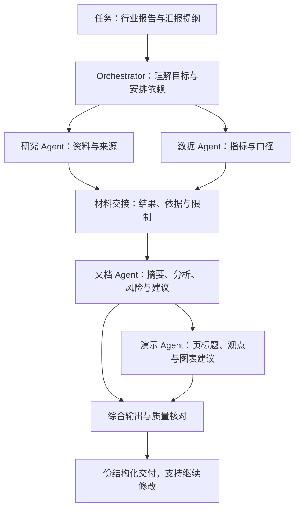
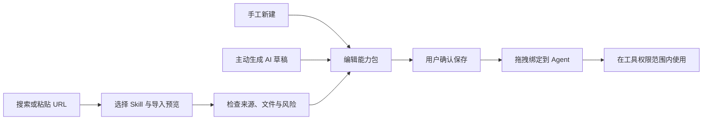
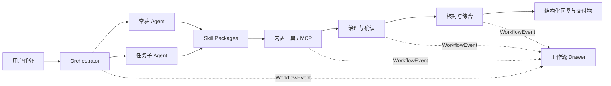

# TAgent

[中文](./README.md) | [English](./README_EN.md)

> 面向非技术用户的可视化多 Agent 办公协作平台。

TAgent 将调研、文档、数据分析、项目管理、沟通邮件和演示汇报等办公任务交给专业 Agent 协作完成。用户可以像发起一段对话一样描述目标，同时在可视化工作流中了解任务如何被拆解、由谁执行、调用了哪些工具、触发了哪些治理规则，以及最终结果基于哪些材料形成。

TAgent 的重点不是把更多 Prompt 塞进聊天窗口，而是让多 Agent 工作变得可理解、可配置、可追溯：

- 普通用户可以直接使用常驻办公 Agent，也可以从一次任务沉淀新的 Agent。
- Agent 通过结构化运行阶段、Skills、工具权限和质量规则执行任务。
- 任务过程以统一事件记录驱动实时流转、静态架构和事件日志。
- Skill 与 MCP 的发现、预览、风险检查、保存和执行授权彼此分离。
- 失败、中断和预算不足都会保留已有材料并返回可读说明，不伪装成成功。

## 为什么是 TAgent

办公任务往往不是一个问题对应一个答案：写报告需要先找资料，分析表格需要说明口径，汇报需要把长文转成面向决策的观点。TAgent 把这些职责交给不同 Agent，再把过程和结果放回同一个工作区，让用户既能拿到交付物，也能看懂它是怎样形成的。

| 你想完成的工作 | TAgent 的协作方式 | 你得到的内容 |
| --- | --- | --- |
| 调研一个行业或近期趋势 | 研究 Agent 检索、读取来源并整理证据，文档 Agent 组织报告 | 有日期、来源链接、结论和信息缺口的报告 |
| 将经营数据整理成简报 | 数据 Agent 核对指标，文档 Agent 解释结果与材料边界 | 结构化简报、统计表与可下载结果 |
| 将报告转成管理层汇报 | 文档 Agent 整理材料，演示 Agent 提炼叙事与页面结构 | 页标题、核心观点、证据与图表建议 |
| 拆解一个项目并准备沟通 | 项目 Agent 整理依赖、风险和责任缺口，沟通 Agent 起草邮件或纪要 | 排期建议、行动项和可编辑的沟通草稿 |
| 复用自己的办公方法 | 把流程保存为 Skill，再挂载到需要的 Agent | 可反复使用的 SOP、模板与检查规则 |

这些是协作场景示例，不是要求每次启动所有 Agent。参与角色由任务需求、依赖、权限和预算决定；缺少资料时会说明限制，而不是补出看似完整的事实。

## 界面速览

### 从任务到可读交付

左侧管理办公 Agent 与会话，中间阅读结构化结果，右侧查看同一次任务的分阶段工作流。侧栏可收起或拖拽调宽，过程与正文互不遮挡。


*真实应用界面，使用合成营收数据演示；截图没有调用模型、联网或执行工具，不代表真实任务质量验收。*

### 看懂并配置 Agent 的能力

Agent 大厅将角色、执行阶段、工具能力、质量规则和雷达评分放在一起。右侧 Skills 库支持搜索与拖拽绑定，用户不必从零编写一整套 Agent。


*图中为内置角色与本地静态能力估算，不是外部 Benchmark 榜单成绩。截图来源与复现方式见 [媒体说明](./docs/media/README.md)。*

## 核心能力

### 专业办公 Agent

系统内置六类常驻 Agent：

| Agent | 主要职责 |
| --- | --- |
| 研究 Agent | 联网检索、来源读取、日期核对、证据整理和调研报告 |
| 文档 Agent | 结构化写作、材料整合、内容修订和 Word 交付 |
| 数据 Agent | 表格读取、统计计算、口径说明、异常检查和 Excel 结果 |
| 项目管理 Agent | 任务拆解、依赖、排期、风险、责任缺口和验收建议 |
| 沟通邮件 Agent | 邮件草稿、会议纪要、行动项和沟通语气调整 |
| 演示汇报 Agent | 页面级提纲、核心结论、证据组织和演示叙事 |

每个 Agent 使用结构化 Agent Card，包含角色设定、职责边界、默认 Skills、工具白名单、MCP 偏好、成本约束、质量规则、失败降级策略和示例任务。运行时采用 `Understand → Plan → Execute → Verify → Synthesize → Handoff` 阶段，而不是单轮 Prompt 调用。

复杂任务可以创建受控子 Agent。子 Agent 继承并收紧父 Agent 的权限与预算，保留父子关系和完整 Trace；只有用户明确确认后，才会复制为新的常驻 Agent。

### 多 Agent 协作写作

用户不需要先画流程图，也不需要在多个聊天窗口之间搬运材料。例如提出“调研近期行业变化，写一份管理层报告，再给出汇报提纲”，Orchestrator 会按需拆出资料收集、数据核对、报告编写和汇报组织等职责。

- **先准备材料，再组织表达**：研究与数据任务可在没有依赖时并行，写作任务等待所需材料就绪后再执行。
- **交接带着依据**：下游 Agent 使用上游的结果与限制说明，而不把搜索片段或模型推测直接当作已核实事实。
- **分工不等于拼接**：综合阶段将各部分整理成一份可读交付，并保留来源、待确认事项和质量检查结果。
- **结果可以继续加工**：用户可在同一会话追加修改要求，或通过 Fork 比较不同写作方向；已结束的回复可下载为可编辑 Word，支持的数据计算结果可另行下载 Excel。



*上图解释一种任务分工，不是固定必跑流程。演示 Agent 交付页面级提纲，不代表自动生成 PPT 文件。*

### 可视化工作流

右侧 Workflow Drawer 与主对话并列，可收起并拖拽调整宽度，提供三个互相一致的视图：

| 视图 | 可以看见什么 | 适合回答的问题 |
| --- | --- | --- |
| 实时流转 | 拆解、调度、调研、工具、治理、综合等分类块；块内滚动查看事件和状态 | 现在做到哪了？哪个工具返回了结果？是否在等待确认？ |
| 静态架构 | 当前 run 的 Agent 卡片、父子关系、任务依赖、工具/MCP、治理与综合节点 | 谁负责哪一部分？谁等待谁？最终结果由哪些执行实例参与形成？ |
| 事件日志 | 同一组事件的原始顺序、时间、Agent、工具、返回长度与已有费用记录 | 刚才具体发生了什么？失败或降级发生在哪一步？ |

架构中的 Agent 卡片展示已记录的角色、输入输出摘要、Skills、工具权限和质量规则。关系边默认显示，并以方向和动态连线呈现关系；支持全景、缩放和定位节点，不必点击某个 Agent 才看见连线。只展示当前任务参与者，避免把整个 Agent 大厅误当成执行流程。


*真实界面中的合成营收任务：数据核对后交给文档助手整理。连线用于解释调度、依赖与工具关系，不代表流经连线的材料已获得独立事实认证。*

三个视图来自同一组 `WorkflowEvent`。实时流转按类别归档，事件日志保留原始顺序；任务事件也用于历史回查、治理记录和 Agent 评分，让过程展示与运行记录保持一致。

### 可视化挂载与插件式扩展

Agent、Skill 与 MCP 分别解决“谁来做”“按什么方法做”“用什么工具做”：

| 对象 | 含义 | 配置方式 |
| --- | --- | --- |
| Agent | 办公角色、执行策略、质量标准与权限边界 | 使用常驻角色，或在 Agent Builder 中创建、编辑 |
| Skill | 可复用的工作方法、说明文档、模板和检查规则 | 从右侧 Skills 库搜索并拖拽到 Agent 卡片；也可在编辑器勾选 |
| MCP | 对接外部工具或数据服务的协议连接 | 在 MCP 管理中预览并保存配置，再在 Agent 编辑器中选择绑定与调用权限 |

在 Agent 大厅，Skills 库与 Agent 卡片分栏显示。找到本地 Skill 后拖到目标 Agent，就能提交能力绑定，不必手工修改配置文件；绑定失败时界面会报告错误，不把拖拽动画当作保存成功。

MCP 的**绑定**与**允许调用**是两个独立控件：把服务挂到 Agent 并不自动赋予执行权，stdio 服务还需要独立的执行授权。Skill 推荐的工具也不会绕过 Agent 的工具白名单。


*这是未保存的界面配置示例；演示服务没有连接外部系统。勾选绑定后，调用权限仍未勾选。*

TAgent 通过 Skill 能力包与 MCP 工具服务实现插件式扩展，不依赖 Codex 等宿主的插件运行时。当前支持 **Skill 拖拽挂载**和 **MCP 表单绑定**，不提供宿主插件安装或独立通用插件商店。

### Skill Package

Skill 是可复用的能力包，不只是一段 Prompt。一个 Skill 可以包含：

- 基础信息、触发条件和适用 Agent
- SOP / Prompt 与执行步骤
- 输入、输出和质量约束
- 工具、MCP 和外部 API 依赖
- 参考资料、模板和检查清单
- 示例任务与最小测试样例
- 风险等级和版本信息

界面把上述内容组织为可视化分区，不要求用户编写 manifest JSON。SOP、参考资料和检查清单可分别添加为文档；输入输出、示例与测试有独立栏目，不需要重复填写。导入包的来源快照与附属文件可展开查看，脚本或二进制附件的存在不意味着获得执行权限。

### 快速构建自己的 Skill

以“把营收表整理成简报”为例：

1. 在 `/management/skills` 点击 **新建 Skill**，填写名称、用途与触发条件。
2. 在 **文档包** 写清 SOP，按需添加参考资料或交付检查清单。
3. 配置输入和产出，例如“营收表与单位 → 摘要、统计表、信息缺口、行动建议”；选用必要工具，不默认开放更多权限。
4. 补一个示例和最小测试，确认内容后保存；到 Agent 大厅拖拽绑定给文档或数据 Agent。


*真实编辑器中的手工草稿，未保存、未调用模型。最小测试执行静态检查，不等于实际办公任务的质量验收。*

另外还有两条独立入口：

- **AI 草稿**：描述要复用的任务场景，主动点击生成，再编辑和确认保存。需要配置模型，可能产生 API 费用。
- **导入现有 Skill**：搜索候选或粘贴 GitHub / `SKILL.md` 链接，选择包内 Skill，查看来源文件与风险后确认保存。



搜索只发现候选，预览只读取候选；两者都不会自动创建、保存或执行外部内容。包内附属文件的读取同样需要权限，不能借 Skill 安装绕过工具限制。

### MCP 管理

MCP 管理支持手工配置、URL/GitHub/npm/Registry 候选发现、导入预览、远程连接测试和工具列表展示。环境变量与认证信息在界面中脱敏。

搜索、导入和执行是三个独立动作：

```text
发现候选 → 查看来源 → 导入预览 → 风险确认 → 保存配置 → 单独授权执行
```

stdio 配置只展示结构化命令和所需环境变量；预览与连接检查不会静默运行外部命令。

### 调研与证据

当任务涉及最新资讯、近 30 天、趋势、新闻或现状时，研究 Agent 会进入联网调研流程。搜索候选与实际读取状态分开记录，最终报告可以展示调研日期、来源日期、URL 和可验证性。

证据核对用于发现来源缺失、日期越界、引用不匹配和材料范围扩大等问题。它是辅助审阅机制，不是独立事实认证；没有发现问题不代表外部事实必然正确。

### 治理与安全

TAgent 将工具能力和执行授权分开管理：

- Agent 只能调用其白名单中的工具与 MCP。
- 高风险操作需要显式确认，超时或保存失败不会授予许可。
- URL、重定向和私有地址访问经过限制。
- 外部 Skill/MCP 必须先预览来源、文件、命令、环境变量和风险。
- 取消或服务中断时保留已完成材料、已知费用和任务状态，不自动重放工具。
- 文件模式支持离线备份；恢复到新目录时撤销旧 MCP 执行授权。

### 会话与分支

Workspace 中的 Session 支持：

- 连续对话与有界上下文
- 完整 Fork 与摘要 Fork
- 分支树和全文 Diff
- 从分支摘取原文并引用回主线
- 任务检查点与异常中断回查

TAgent 不自动合并整段对话。用户通过“结论摘取引用 + Diff”决定哪些内容回到主线。

### Agent 评测

Agent 大厅使用七个维度展示能力：调研与事实验证、指令遵循、工具使用、规划拆解、办公交付、治理安全和协作交接。

评分会明确标注来源：静态配置估算、已保存任务观察或用户手动触发的固定材料 Benchmark。打开大厅不会自动产生模型费用，评测结果也不会被描述为外部权威榜单成绩。

## 系统架构



```text
packages/
  tagent-ai/       LLM Provider 抽象、流式事件、工具调用与费用计算
  tagent-core/     Agent Runtime、Orchestrator、Skills、MCP、治理与 Trace
  tagent-server/   Hono API、SSE、WebSocket、持久化与管理接口
  tagent-web/      Next.js Web 应用、对话、工作流与管理中心
  tagent-desktop/  Electron 桌面端代码目录
```

核心数据流：

```text
用户任务
  → Orchestrator 理解与拆解
  → 选择常驻 Agent / 创建任务子 Agent
  → Skills + 工具/MCP 权限执行
  → 统一 WorkflowEvent 与治理记录
  → 质量核对、综合和交接
  → 结构化回复、来源与可下载交付物
```

## 快速开始

### 环境要求

- Node.js `>= 22.13`
- pnpm `10.12.1`
- 至少一个受支持的模型 API Key
- PostgreSQL 和 Redis 可选；未配置时使用本地文件持久化

### 安装

```bash
git clone https://github.com/liulinlin718-netizen/TAgent.git
cd TAgent
pnpm install --frozen-lockfile --ignore-scripts
```

复制后端配置：

```bash
cp packages/tagent-server/.env.example packages/tagent-server/.env
```

配置以下任一模型：

```dotenv
DEEPSEEK_API_KEY=...
# ANTHROPIC_API_KEY=...
# OPENAI_API_KEY=...
```

可通过 `TAGENT_LLM_PROVIDER` 和 `TAGENT_LLM_MODEL` 显式选择 Provider 与模型。调研搜索、访问保护、数据库、Redis 和可选办公核对模型的配置项见 [.env.example](./packages/tagent-server/.env.example)。

### 本地运行

Windows 本机生产构建与受控启动：

```powershell
pnpm local:build
pnpm local:start
```

访问：

- Web：<http://127.0.0.1:3000/>
- Health：<http://127.0.0.1:3001/api/health>

停止服务：

```powershell
pnpm local:stop
```

通用开发模式：

```bash
pnpm dev
```

### 第一次使用

| 入口 | 建议操作 |
| --- | --- |
| 工作区 `/` | 用一句话说明目标、读者、时间范围和材料；例如“将这份营收表写成管理层简报，缺失信息单独列出” |
| 右侧工作流 | 展开实时流转看状态，切换静态架构看分工，遇到异常再查事件日志 |
| Agent 大厅 `/management/agents` | 选择常驻角色，拖拽 Skill；需要 MCP 时编辑对应 Agent 的绑定与权限 |
| Skills `/management/skills` | 从一个常做的办公流程开始构建 Skill，或导入经过检查的已有能力包 |
| MCP `/management/mcp` | 发现服务、预览风险、保存配置；确认权限后再交给 Agent 使用 |

不接入额外 MCP 也可以使用内置办公能力。先用简单任务明确交付要求，再按实际需要增加 Skill 和外部服务；邮件发送、外部命令等高影响操作不会因配置能力而自动获得授权。

### 工程检查

```bash
pnpm check
```

该命令执行共享包构建、类型检查、lint、单元测试、Web 生产构建和隔离接口检查。真实模型、搜索和第三方 MCP 连接需要单独授权，不属于默认检查。

## 重要接口

- `GET /api/health`
- `POST /api/agent/orchestrate`
- Workspace / Session / Fork / Diff / Quote APIs
- Skills / MCP / Agents / Governance 管理 APIs
- Benchmark 与 Runtime APIs

前端工作流只消费共享的 `WorkflowEvent`；Agent 大厅、Orchestrator 和 Benchmark 共享 `AgentCardV2`；Skill 编辑、导入和绑定共享 `SkillPackage`。

## 部署与数据

默认服务仅监听 `127.0.0.1`。如需通过网络访问，请配置 HTTPS、可信站点来源和独立访问码，参阅 [自托管访问保护](./docs/self-hosted-access.md)。安全模型面向单实例所有者部署，不应直接视为多租户 SaaS 权限系统。

未配置 `DATABASE_URL` 时，数据保存在项目数据目录；配置后可使用 PostgreSQL。`REDIS_URL` 为可选缓存。不要让多个后端实例同时写入同一个文件数据目录。

## 文档导航

- [实现与产品设计](./implementation_plan.md)
- [本机 Windows 运行](./docs/local-windows.md)
- [访问保护](./docs/self-hosted-access.md)
- [调研搜索](./docs/research-search.md)
- [办公交付核对](./docs/office-delivery.md)
- [工作流与长任务](./docs/workflow-performance.md)
- [Agent 评测](./docs/agent-benchmark.md)
- [工具确认与导入治理](./docs/governance-approval.md)
- [连续对话与分支](./docs/session-context.md)
- [数据分析与 Excel](./docs/data-analysis.md)
- [Word 导出](./docs/report-export.md)
- [备份与恢复](./docs/data-backup.md)

## 独立工具

TAgent 的三个通用机制也以小型、可独立使用的开源工具提供：

- [Agent Trace Kit](https://github.com/liulinlin718-netizen/agent-trace-kit)：校验、整理和查询 Agent WorkflowEvent JSONL。
- [Approval-First Import](https://github.com/liulinlin718-netizen/approval-first-import)：为 Skill/MCP 导入提供内容绑定的预览与确认门。
- [Evidence-Bound Review](https://github.com/liulinlin718-netizen/evidence-bound-review)：在给定材料范围内检查办公报告的明确约束冲突。

## 参与贡献

欢迎通过 [Issues](https://github.com/liulinlin718-netizen/TAgent/issues) 提交可复现的问题、产品建议和安全边界讨论。代码贡献请保持修改范围清晰，并在提交前运行 `pnpm check`。请勿在 Issue、日志或测试夹具中上传 API Key、真实会话、业务文件或其他敏感信息。

## 许可

[MIT License](./LICENSE)。第三方依赖和导入内容遵循其各自许可证。
