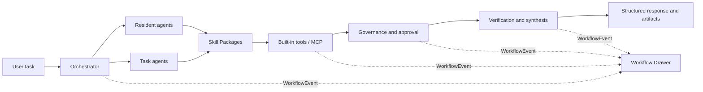

# TAgent

[中文](./README.md) | [English](./README_EN.md)

> A visual multi-agent office collaboration platform designed for non-technical users.

TAgent delegates research, document writing, data analysis, project planning, email communication, and presentation work to specialized agents. A user describes a goal as naturally as starting a conversation, while the interface explains how the task is decomposed, which agents participate, what tools are called, which governance rules are triggered, and what evidence supports the final result.

TAgent is not a collection of prompts hidden behind a chat box. Its purpose is to make multi-agent work understandable, configurable, and traceable:

- People can use resident office agents directly or turn a successful task agent into a reusable agent.
- Agents execute through explicit runtime stages, Skills, tool policies, and quality checks.
- One canonical event stream powers live flow, architecture, governance, and history views.
- Skill and MCP discovery, preview, risk review, saving, and execution authorization are separate operations.
- Failures, cancellation, and insufficient budget preserve completed material and return a readable outcome instead of pretending success.

## Core Capabilities

### Specialized Office Agents

TAgent includes six resident agent roles:

| Agent | Primary responsibility |
| --- | --- |
| Research | Web research, source reading, date checks, evidence organization, and research reports |
| Document | Structured writing, material synthesis, revision, and editable Word delivery |
| Data | Spreadsheet ingestion, calculation, methodology notes, anomaly checks, and Excel output |
| Project Management | Task decomposition, dependencies, schedules, risks, ownership gaps, and acceptance suggestions |
| Communication | Email drafts, meeting notes, action items, and tone adaptation |
| Presentation | Slide-level outlines, key messages, evidence structure, and presentation narrative |

Each role uses a structured Agent Card containing its soul, responsibility boundaries, default Skills, tool allowlist, MCP preferences, cost constraints, quality rules, fallback behavior, and example tasks. Runtime follows `Understand → Plan → Execute → Verify → Synthesize → Handoff` rather than a single prompt-response cycle.

Complex plans may create controlled task agents. A child inherits and narrows the parent's capabilities and budget, records its parent relationship and trace, and becomes a resident agent only after explicit user confirmation.

### Visual Workflow

The resizable Workflow Drawer sits beside the conversation and provides three views derived from the same `WorkflowEvent` stream:

- **Live flow** groups decomposition, dispatch, research, tools, governance, and synthesis into readable stages.
- **Architecture** shows only the agents, tools, MCP servers, and governance nodes involved in the selected run, with relationship edges visible by default.
- **Event log** supports filtering and paginated inspection by run, agent, and event type.

The shared event model also drives history, governance records, and trace-aware agent evaluation, preventing each screen from inventing a different execution story.

### Skill Packages

A Skill is a reusable capability package, not just a prompt file. It may contain:

- metadata, triggers, and applicable agents
- SOPs, prompts, and execution steps
- input, output, and quality constraints
- tool, MCP, and external API dependencies
- references, templates, and checklists
- examples and minimal tests
- risk level and version information

The management UI presents a simple editor for everyday users and reveals advanced fields only when needed. Skills can be authored locally or imported through a review flow from GitHub and other URLs. Search and preview never silently save or execute remote content.

### MCP Management

MCP management supports manual configuration, discovery from URLs, GitHub, npm, and registry-style sources, import previews, remote connection tests, and tool-list inspection. Environment variables and authentication data are redacted in the UI.

```text
Discover → inspect source → import preview → risk confirmation
         → save configuration → separately authorize execution
```

stdio candidates expose structured commands and required environment variables. Previewing or testing a configuration does not silently run an external command.

### Research and Evidence

Tasks involving current news, recent developments, trends, or a time window enter the research workflow. Candidate search results and actually read sources are recorded separately. Reports can expose the research date, source date, URL, and verifiability.

Evidence checks help locate missing sources, out-of-window dates, citation mismatches, and claims that exceed the supplied material. They support human review; they are not independent fact certification, and “no finding” does not prove an external claim is true.

### Governance and Safety

TAgent separates capability from permission:

- An agent may call only allowlisted tools and MCP servers.
- High-impact operations require explicit confirmation; timeout or persistence failure does not grant permission.
- URL, redirect, and private-network access are constrained.
- External Skills and MCP configurations must expose source, files, commands, environment requirements, and risk before saving.
- Cancellation or service interruption preserves completed material, known cost, and task state without replaying tools automatically.
- File-mode data can be backed up offline; restoring to a new directory revokes prior MCP execution authorization.

### Sessions and Branches

Workspace sessions support bounded conversation context, full and summarized forks, branch trees, full-text diffs, quoting selected branch material back into the main line, and recovery from persisted checkpoints.

TAgent does not merge conversations automatically. Users decide what returns to the main thread through quote extraction and diff views.

### Agent Evaluation

The Agent Hall visualizes seven dimensions: research and verification, instruction following, tool use, planning, office delivery, governance, and collaboration.

Every score identifies its source: static configuration estimate, evidence from saved runs, or a manually triggered fixed-material benchmark. Opening the page never starts a paid evaluation, and internal scores are not presented as results from an external public leaderboard.

## Architecture



```text
packages/
  tagent-ai/       LLM providers, streaming events, tool calls, and cost accounting
  tagent-core/     Agent runtime, orchestration, Skills, MCP, governance, and traces
  tagent-server/   Hono APIs, SSE, WebSocket, persistence, and management routes
  tagent-web/      Next.js conversation UI, workflow views, and management center
  tagent-desktop/  Electron desktop source directory
```

## Quick Start

### Requirements

- Node.js `>= 22.13`
- pnpm `10.12.1`
- At least one supported model API key
- PostgreSQL and Redis are optional; local file persistence is used without them

### Install

```bash
git clone https://github.com/liulinlin718-netizen/TAgent.git
cd TAgent
pnpm install --frozen-lockfile --ignore-scripts
cp packages/tagent-server/.env.example packages/tagent-server/.env
```

Configure one provider in `.env`:

```dotenv
DEEPSEEK_API_KEY=...
# ANTHROPIC_API_KEY=...
# OPENAI_API_KEY=...
```

Use `TAGENT_LLM_PROVIDER` and `TAGENT_LLM_MODEL` to select a provider and model explicitly. Search, access control, database, Redis, and optional office-review settings are documented in [.env.example](./packages/tagent-server/.env.example).

### Run Locally

Controlled Windows production build and launcher:

```powershell
pnpm local:build
pnpm local:start
```

- Web: <http://127.0.0.1:3000/>
- Health: <http://127.0.0.1:3001/api/health>

Stop the local instance:

```powershell
pnpm local:stop
```

General development mode:

```bash
pnpm dev
```

### Engineering Checks

```bash
pnpm check
```

The check command builds shared packages, runs type checking, linting, unit tests, the Web production build, and isolated API checks. Live model, search, and third-party MCP calls require separate authorization and are not part of the default check.

## Important Interfaces

- `GET /api/health`
- `POST /api/agent/orchestrate`
- Workspace, Session, Fork, Diff, and Quote APIs
- Skills, MCP, Agents, and Governance management APIs
- Benchmark and Runtime APIs

The workflow UI consumes shared `WorkflowEvent` records. The Agent Hall, Orchestrator, and Benchmark use `AgentCardV2`; Skill editing, import, and binding use `SkillPackage`.

## Deployment and Data

The service listens on `127.0.0.1` by default. Network deployment requires HTTPS, trusted origins, and an independent access token; see [Self-hosted access protection](./docs/self-hosted-access.md). The security model targets a single-instance owner deployment and must not be treated as a multi-tenant SaaS authorization system.

Without `DATABASE_URL`, data is stored in the project data directory. PostgreSQL can be enabled through configuration; `REDIS_URL` is optional. Do not run multiple backend processes against the same file data directory.

## Documentation

- [Product and implementation design](./implementation_plan.md)
- [Local Windows runtime](./docs/local-windows.md)
- [Self-hosted access](./docs/self-hosted-access.md)
- [Research search](./docs/research-search.md)
- [Office delivery review](./docs/office-delivery.md)
- [Workflow performance](./docs/workflow-performance.md)
- [Agent benchmark](./docs/agent-benchmark.md)
- [Governance and approvals](./docs/governance-approval.md)
- [Sessions and branch context](./docs/session-context.md)
- [Data analysis and Excel](./docs/data-analysis.md)
- [Word export](./docs/report-export.md)
- [Backup and restore](./docs/data-backup.md)

## Standalone Tools

Three reusable mechanisms are also available as focused standalone projects:

- [Agent Trace Kit](https://github.com/liulinlin718-netizen/agent-trace-kit) validates and queries agent WorkflowEvent JSONL.
- [Approval-First Import](https://github.com/liulinlin718-netizen/approval-first-import) provides content-bound preview and confirmation for Skill/MCP imports.
- [Evidence-Bound Review](https://github.com/liulinlin718-netizen/evidence-bound-review) checks explicit office-report constraints against supplied evidence.

## Contributing

Use [GitHub Issues](https://github.com/liulinlin718-netizen/TAgent/issues) for reproducible bugs, product proposals, and security-boundary discussions. Keep code changes focused and run `pnpm check` before submitting them. Never attach API keys, real conversations, business files, or other sensitive data to issues, logs, or fixtures.

## License

[MIT License](./LICENSE). Third-party dependencies and imported content remain under their respective licenses.
