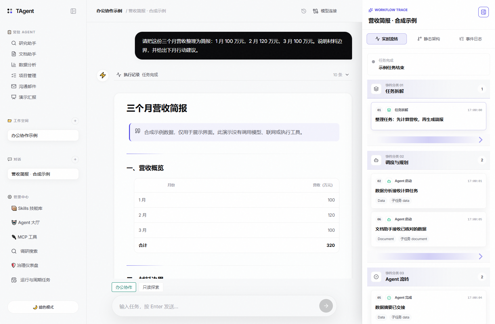
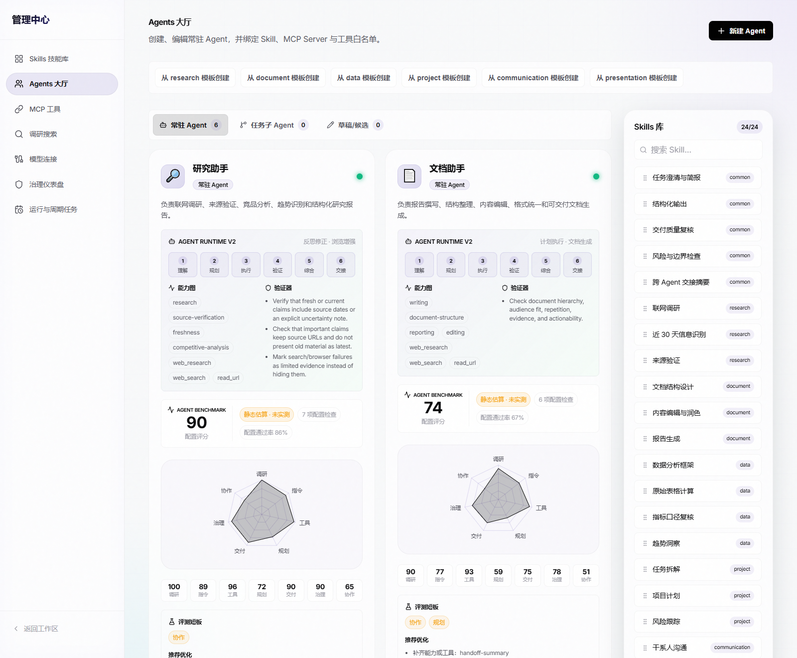
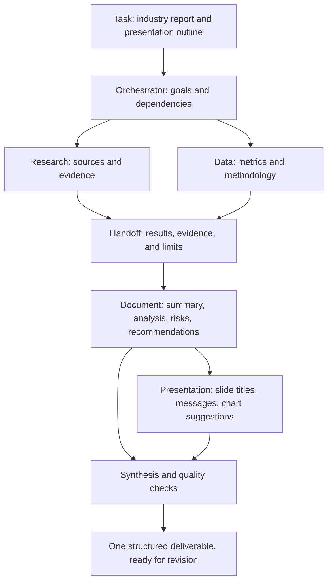
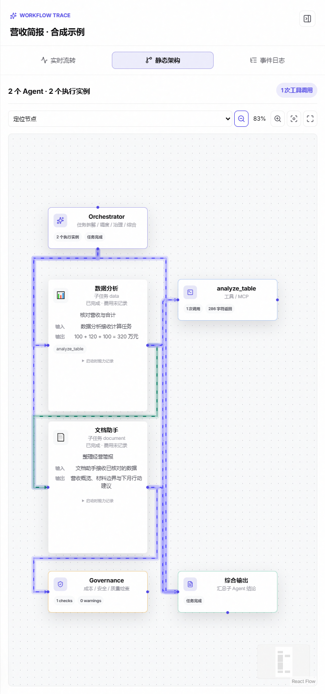
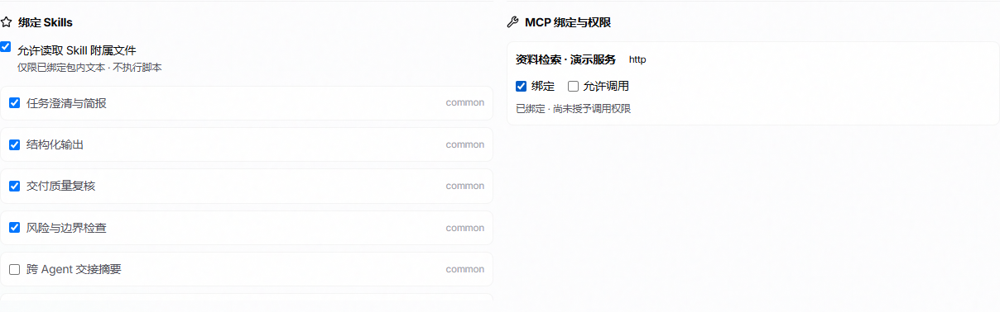
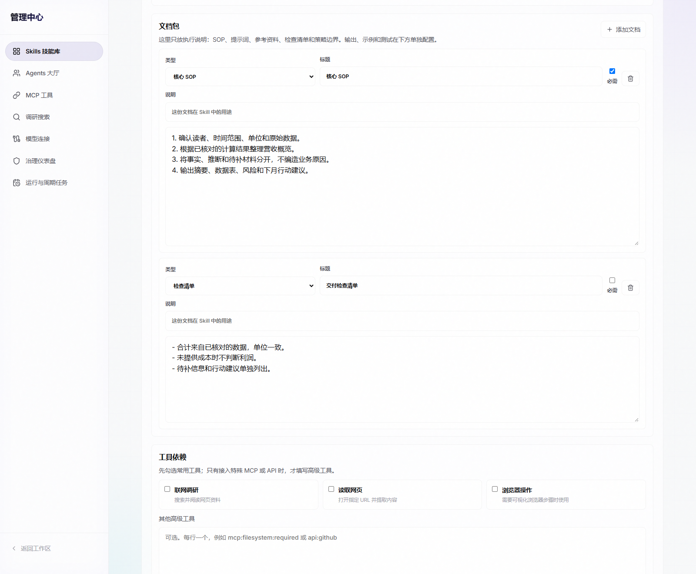
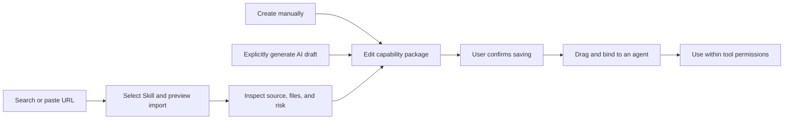
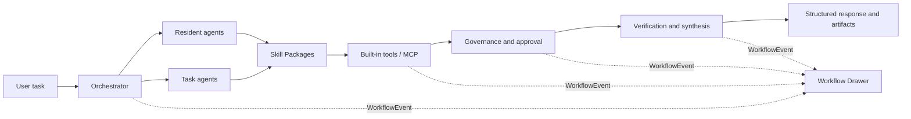

# TAgent

[中文](./README.md) | [English](./README_EN.md)

> A visual multi-agent office collaboration platform designed for non-technical users.

TAgent delegates research, document writing, data analysis, project planning, email communication, and presentation work to specialized agents. A user describes a goal as naturally as starting a conversation, while the interface explains how the task is decomposed, which agents participate, what tools are called, which governance rules are triggered, and what evidence supports the final result.

TAgent is not a collection of prompts hidden behind a chat box. Its purpose is to make multi-agent work understandable, configurable, and traceable:

- People can use resident office agents directly or turn a successful task agent into a reusable agent.
- Agents execute through explicit runtime stages, Skills, tool policies, and quality checks.
- One canonical event stream powers live flow, architecture, governance, and history views.
- Skill and MCP discovery, preview, risk review, saving, and execution authorization are separate operations.
- Failures, cancellation, and insufficient budget preserve completed material and return a readable outcome instead of pretending success.

## Why TAgent

Office work rarely maps to a single question and answer. Reports need research, spreadsheets need a defined methodology, and presentations need decision-oriented messages rather than a wall of text. TAgent assigns these responsibilities to different agents, then brings the process and deliverable back into one workspace.

| Your goal | How agents collaborate | What you receive |
| --- | --- | --- |
| Research an industry or recent trend | Research gathers and reads sources; Document organizes the report | A report with dates, source links, conclusions, and evidence gaps |
| Turn business data into a brief | Data checks metrics; Document explains results and material limits | A structured brief, statistical tables, and supported downloadable output |
| Prepare a management presentation | Document organizes material; Presentation develops the narrative | Slide titles, key messages, evidence, and chart suggestions |
| Plan a project and communicate it | Project identifies dependencies and ownership gaps; Communication drafts messages | Schedule suggestions, action items, and editable communication drafts |
| Reuse an office procedure | Save it as a Skill and bind it to the appropriate agents | Reusable SOPs, templates, and checks |

These are example workflows, not a requirement to run every agent. Participants depend on the task, dependencies, permissions, and budget. Missing material is identified rather than replaced with invented facts.

## Interface Tour

### From a Task to a Readable Deliverable

The left column holds office agents and conversations, the center presents the structured result, and the right column shows the stages of the same run. The workflow panel can be collapsed or resized without covering the conversation.



*Actual application UI with synthetic revenue data. No model calls, web research, or tool execution were performed for this screenshot; it is a UI demonstration, not a real-task quality evaluation.*

### Understand and Configure Agent Capabilities

The Agent Hall brings roles, execution stages, tools, quality rules, and radar scores together. The searchable Skills library supports drag-and-drop binding, so users do not need to design an agent from scratch.



*The image shows built-in roles and static configuration estimates, not external benchmark rankings. See [media notes](./docs/media/README.md) for provenance and reproduction.*

## Core Capabilities

### Specialized Office Agents

TAgent includes six resident agent roles:

| Agent | Primary responsibility |
| --- | --- |
| Research | Web research, source reading, date checks, evidence organization, and research reports |
| Document | Structured writing, material synthesis, revision, and editable Word delivery |
| Data | Spreadsheet ingestion, calculation, methodology notes, anomaly checks, and Excel output |
| Project Management | Task decomposition, dependencies, schedules, risks, ownership gaps, and acceptance suggestions |
| Communication | Email drafts, meeting notes, action items, and tone adaptation |
| Presentation | Slide-level outlines, key messages, evidence structure, and presentation narrative |

Each role uses a structured Agent Card containing its soul, responsibility boundaries, default Skills, tool allowlist, MCP preferences, cost constraints, quality rules, fallback behavior, and example tasks. Runtime follows `Understand → Plan → Execute → Verify → Synthesize → Handoff` rather than a single prompt-response cycle.

Complex plans may create controlled task agents. A child inherits and narrows the parent's capabilities and budget, records its parent relationship and trace, and becomes a resident agent only after explicit user confirmation.

### Multi-Agent Writing

There is no need to draw a workflow first or move material between several chat windows. For a request such as “research recent industry changes, write a management report, and prepare a presentation outline,” the Orchestrator can assign source gathering, data checks, writing, and presentation work to appropriate agents.

- **Prepare material before writing:** independent research and data tasks can run concurrently; dependent writing starts when its inputs are ready.
- **Handoff includes evidence and limits:** downstream agents receive upstream results and caveats, rather than treating search snippets or model guesses as verified facts.
- **Synthesis is more than concatenation:** results are organized into a readable deliverable with sources, open questions, and recorded quality checks.
- **Keep working on the result:** request revisions in the same session or use Fork to compare writing directions. Finished responses can be downloaded as editable Word documents; supported calculation results have separate Excel downloads.



*This diagram explains one possible division of work, not a mandatory execution sequence. The Presentation agent produces a slide-level outline; this does not imply automatic PPT file generation.*

### Visual Workflow

The resizable Workflow Drawer sits beside the conversation and provides three views derived from the same `WorkflowEvent` stream:

| View | What it shows | What it helps you understand |
| --- | --- | --- |
| Live flow | Scrollable groups for decomposition, dispatch, research, tools, governance, and synthesis | Current activity, returned tool results, and pending approval |
| Architecture | Agent cards, parent-child links, dependencies, tools/MCP, governance, and synthesis for this run | Who owns each part, who depends on whom, and which execution instances contributed |
| Event log | Original event order, timestamps, agents, tools, result lengths, and recorded costs | What happened, and where failure or fallback occurred |

Agent cards expose recorded roles, input/output summaries, Skills, tool permissions, and quality rules. Directional relationship edges are visible by default, with animated connections, overview, zoom, and node navigation. You do not need to select an agent to reveal its edges. Only participants in the selected task appear, rather than the entire Agent Hall.



*Actual UI with the synthetic revenue task: checked data is handed to the Document agent. Connections explain dispatch, dependencies, and tool relationships; they are not independent factual certification of the material.*

All three views consume the same `WorkflowEvent` records. Live flow organizes them by category, while the log preserves their original order. The shared model also supports history, governance records, and trace-aware evaluation.

### Visual Binding and Plugin-Style Extension

Agents, Skills, and MCP answer different questions: **who does the work**, **how it is done**, and **which tools it uses**.

| Object | Purpose | How you configure it |
| --- | --- | --- |
| Agent | Office role, execution strategy, quality standard, and permission boundaries | Use a resident role or create/edit an Agent Card |
| Skill | Reusable procedures, documents, templates, and checks | Search the right-side library and drag onto an agent card, or select in the editor |
| MCP | Protocol connections to external tools or data services | Preview and save in MCP management, then select bindings and call permissions in the Agent editor |

The Agent Hall keeps the Skills library separate from the agent cards. Drag a local Skill onto its target to submit a binding without editing configuration files. A failed save is reported; a completed drag animation is not treated as successful persistence.

MCP **binding** and **permission to call** are separate controls. Attaching a service does not authorize it; stdio services also require independent execution approval. Tools recommended by a Skill cannot bypass the agent's allowlist.



*Unsaved UI configuration example. The demonstration service is not connected to an external system. Binding is selected while call permission remains unselected.*

TAgent provides plugin-style extension through Skill packages and MCP services, independent of a host such as Codex. It supports **Skill drag-and-drop binding** and **MCP form-based binding**, not host plugin installation or a separate general-purpose plugin marketplace.

### Skill Packages

A Skill is a reusable capability package, not just a prompt file. It may contain:

- metadata, triggers, and applicable agents
- SOPs, prompts, and execution steps
- input, output, and quality constraints
- tool, MCP, and external API dependencies
- references, templates, and checklists
- examples and minimal tests
- risk level and version information

The editor organizes these fields visually rather than requiring manifest JSON. SOPs, references, and checklists can be separate documents, while inputs, outputs, examples, and tests have their own fields without duplicate entry. Imported source snapshots and attached files can be expanded for inspection. A script or binary attachment does not grant execution permission.

### Build a Skill Quickly

For a reusable “revenue table to business brief” Skill:

1. Open `/management/skills`, choose **New Skill**, and specify its name, purpose, and triggers.
2. Write an SOP in the document package; add references or a delivery checklist when useful.
3. Define inputs and outputs, such as “revenue table and units → summary, statistical table, missing information, action suggestions.” Select only necessary tools.
4. Add an example and a minimal test, review and save, then drag the Skill onto the appropriate Document or Data agent.



*Hand-written draft in the actual editor; not saved and no model was called. Minimal tests perform static checks, not real-task quality evaluation.*

Two other entry points remain separate:

- **AI draft:** describe a reusable task, explicitly generate a draft, then edit and confirm. This requires a configured model and may incur API costs.
- **Import an existing Skill:** find a candidate or paste a GitHub / `SKILL.md` URL, select the Skill within its package, inspect source files and risks, then confirm saving.



Search discovers candidates; preview reads candidates. Neither silently creates, saves, or executes external content. Reading attached package files also requires permission; installing a Skill is not a shortcut around tool restrictions.

### MCP Management

MCP management supports manual configuration, discovery from URLs, GitHub, npm, and registry-style sources, import previews, remote connection tests, and tool-list inspection. Environment variables and authentication data are redacted in the UI.

```text
Discover → inspect source → import preview → risk confirmation
         → save configuration → separately authorize execution
```

stdio candidates expose structured commands and required environment variables. Previewing or testing a configuration does not silently run an external command.

### Research and Evidence

Tasks involving current news, recent developments, trends, or a time window enter the research workflow. Candidate search results and actually read sources are recorded separately. Reports can expose the research date, source date, URL, and verifiability.

Evidence checks help locate missing sources, out-of-window dates, citation mismatches, and claims that exceed the supplied material. They support human review; they are not independent fact certification, and “no finding” does not prove an external claim is true.

### Governance and Safety

TAgent separates capability from permission:

- An agent may call only allowlisted tools and MCP servers.
- High-impact operations require explicit confirmation; timeout or persistence failure does not grant permission.
- URL, redirect, and private-network access are constrained.
- External Skills and MCP configurations must expose source, files, commands, environment requirements, and risk before saving.
- Cancellation or service interruption preserves completed material, known cost, and task state without replaying tools automatically.
- File-mode data can be backed up offline; restoring to a new directory revokes prior MCP execution authorization.

### Sessions and Branches

Workspace sessions support bounded conversation context, full and summarized forks, branch trees, full-text diffs, quoting selected branch material back into the main line, and recovery from persisted checkpoints.

TAgent does not merge conversations automatically. Users decide what returns to the main thread through quote extraction and diff views.

### Agent Evaluation

The Agent Hall visualizes seven dimensions: research and verification, instruction following, tool use, planning, office delivery, governance, and collaboration.

Every score identifies its source: static configuration estimate, evidence from saved runs, or a manually triggered fixed-material benchmark. Opening the page never starts a paid evaluation, and internal scores are not presented as results from an external public leaderboard.

## Architecture



```text
packages/
  tagent-ai/       LLM providers, streaming events, tool calls, and cost accounting
  tagent-core/     Agent runtime, orchestration, Skills, MCP, governance, and traces
  tagent-server/   Hono APIs, SSE, WebSocket, persistence, and management routes
  tagent-web/      Next.js conversation UI, workflow views, and management center
  tagent-desktop/  Electron desktop source directory
```

## Quick Start

### Requirements

- Node.js `>= 22.13`
- pnpm `10.12.1`
- At least one supported model API key
- PostgreSQL and Redis are optional; local file persistence is used without them

### Install

```bash
git clone https://github.com/liulinlin718-netizen/TAgent.git
cd TAgent
pnpm install --frozen-lockfile --ignore-scripts
cp packages/tagent-server/.env.example packages/tagent-server/.env
```

Configure one provider in `.env`:

```dotenv
DEEPSEEK_API_KEY=...
# ANTHROPIC_API_KEY=...
# OPENAI_API_KEY=...
```

Use `TAGENT_LLM_PROVIDER` and `TAGENT_LLM_MODEL` to select a provider and model explicitly. Search, access control, database, Redis, and optional office-review settings are documented in [.env.example](./packages/tagent-server/.env.example).

### Run Locally

Controlled Windows production build and launcher:

```powershell
pnpm local:build
pnpm local:start
```

- Web: <http://127.0.0.1:3000/>
- Health: <http://127.0.0.1:3001/api/health>

Stop the local instance:

```powershell
pnpm local:stop
```

General development mode:

```bash
pnpm dev
```

### First Use

| Entry point | Suggested action |
| --- | --- |
| Workspace `/` | Describe the goal, audience, time window, and material; for example, “turn this revenue table into a management brief and list missing information separately” |
| Workflow panel | Check live progress, inspect division of work in Architecture, and consult the event log for unexpected outcomes |
| Agent Hall `/management/agents` | Choose a resident role and drag in a Skill; edit the agent when binding MCP and setting permissions |
| Skills `/management/skills` | Start with one familiar office procedure, or import a reviewed capability package |
| MCP `/management/mcp` | Discover, preview risk, and save configuration; authorize access before agent use |

Built-in office capabilities do not require additional MCP services. Start with a small task and clear deliverable requirements, then add Skills and external services as needed. Configuring capabilities does not automatically authorize high-impact actions such as sending email or executing external commands.

### Engineering Checks

```bash
pnpm check
```

The check command builds shared packages, runs type checking, linting, unit tests, the Web production build, and isolated API checks. Live model, search, and third-party MCP calls require separate authorization and are not part of the default check.

## Important Interfaces

- `GET /api/health`
- `POST /api/agent/orchestrate`
- Workspace, Session, Fork, Diff, and Quote APIs
- Skills, MCP, Agents, and Governance management APIs
- Benchmark and Runtime APIs

The workflow UI consumes shared `WorkflowEvent` records. The Agent Hall, Orchestrator, and Benchmark use `AgentCardV2`; Skill editing, import, and binding use `SkillPackage`.

## Deployment and Data

The service listens on `127.0.0.1` by default. Network deployment requires HTTPS, trusted origins, and an independent access token; see [Self-hosted access protection](./docs/self-hosted-access.md). The security model targets a single-instance owner deployment and must not be treated as a multi-tenant SaaS authorization system.

Without `DATABASE_URL`, data is stored in the project data directory. PostgreSQL can be enabled through configuration; `REDIS_URL` is optional. Do not run multiple backend processes against the same file data directory.

## Documentation

- [Product and implementation design](./implementation_plan.md)
- [Local Windows runtime](./docs/local-windows.md)
- [Self-hosted access](./docs/self-hosted-access.md)
- [Research search](./docs/research-search.md)
- [Office delivery review](./docs/office-delivery.md)
- [Workflow performance](./docs/workflow-performance.md)
- [Agent benchmark](./docs/agent-benchmark.md)
- [Governance and approvals](./docs/governance-approval.md)
- [Sessions and branch context](./docs/session-context.md)
- [Data analysis and Excel](./docs/data-analysis.md)
- [Word export](./docs/report-export.md)
- [Backup and restore](./docs/data-backup.md)

## Standalone Tools

Three reusable mechanisms are also available as focused standalone projects:

- [Agent Trace Kit](https://github.com/liulinlin718-netizen/agent-trace-kit) validates and queries agent WorkflowEvent JSONL.
- [Approval-First Import](https://github.com/liulinlin718-netizen/approval-first-import) provides content-bound preview and confirmation for Skill/MCP imports.
- [Evidence-Bound Review](https://github.com/liulinlin718-netizen/evidence-bound-review) checks explicit office-report constraints against supplied evidence.

## Contributing

Use [GitHub Issues](https://github.com/liulinlin718-netizen/TAgent/issues) for reproducible bugs, product proposals, and security-boundary discussions. Keep code changes focused and run `pnpm check` before submitting them. Never attach API keys, real conversations, business files, or other sensitive data to issues, logs, or fixtures.

## License

[MIT License](./LICENSE). Third-party dependencies and imported content remain under their respective licenses.
