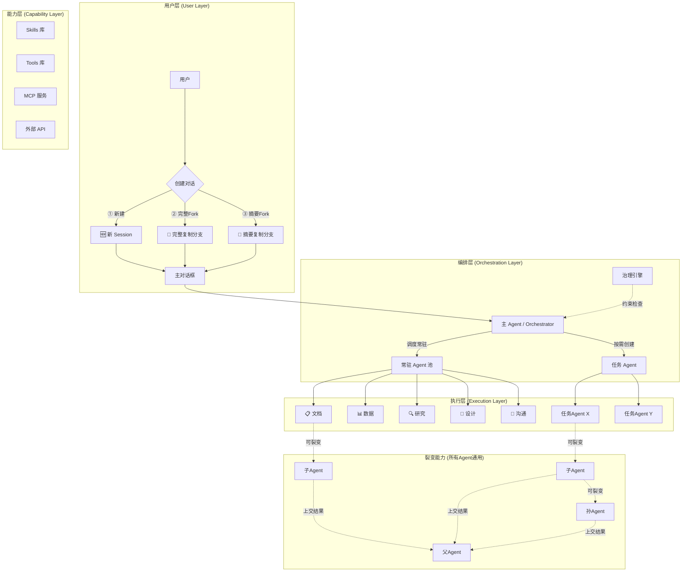
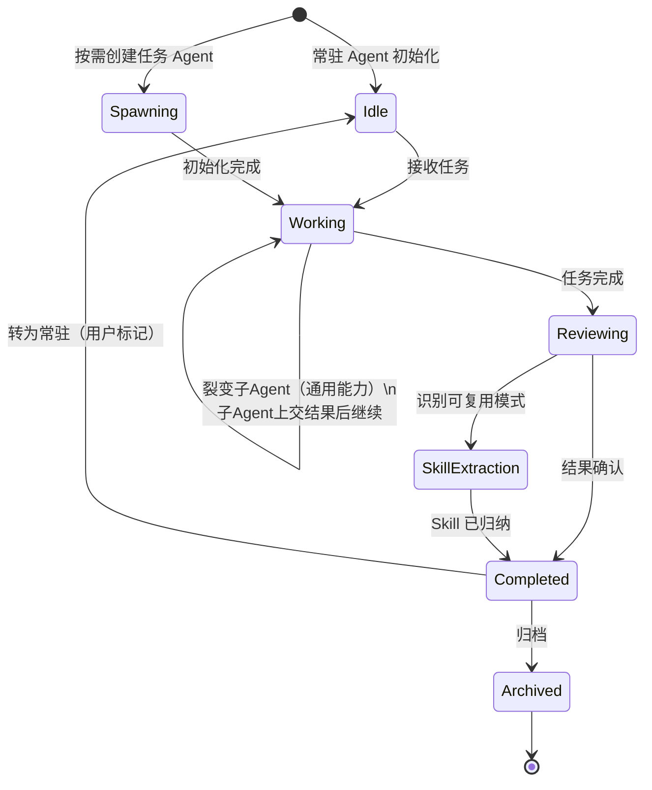
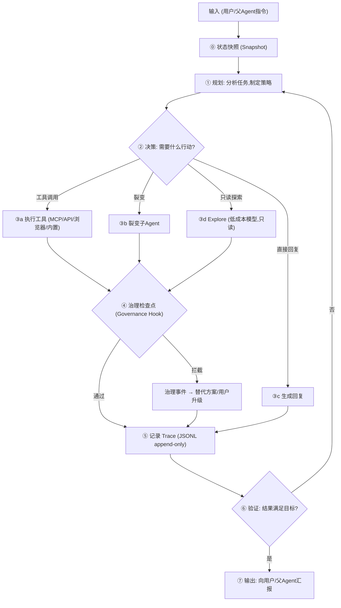
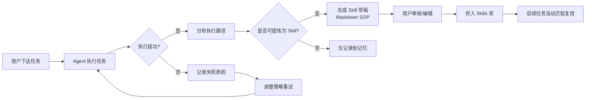
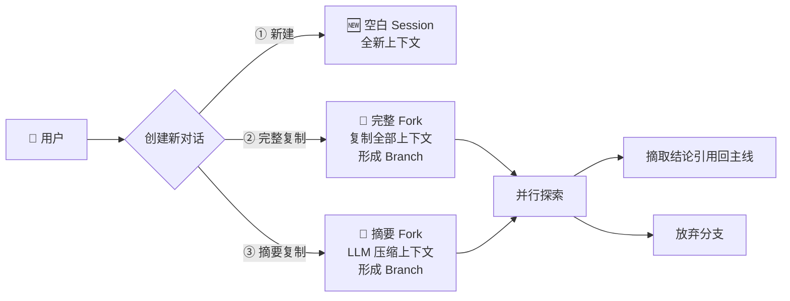
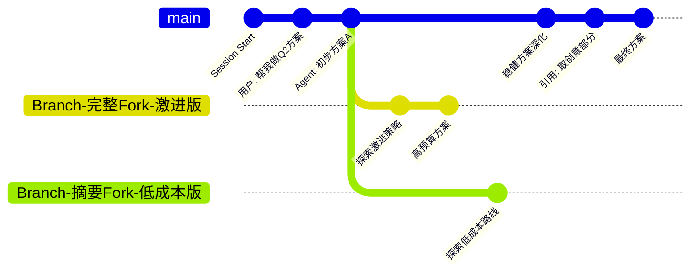
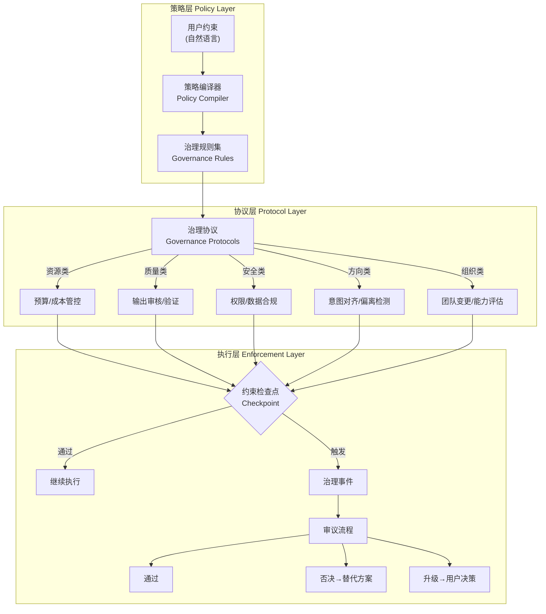
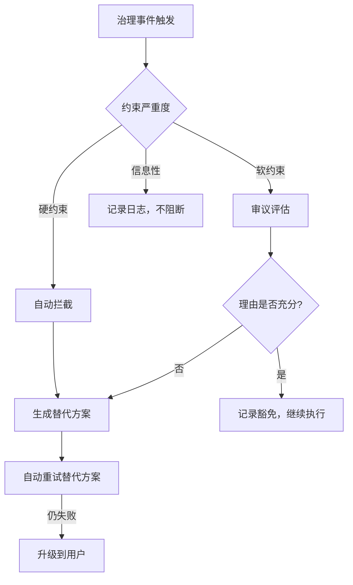
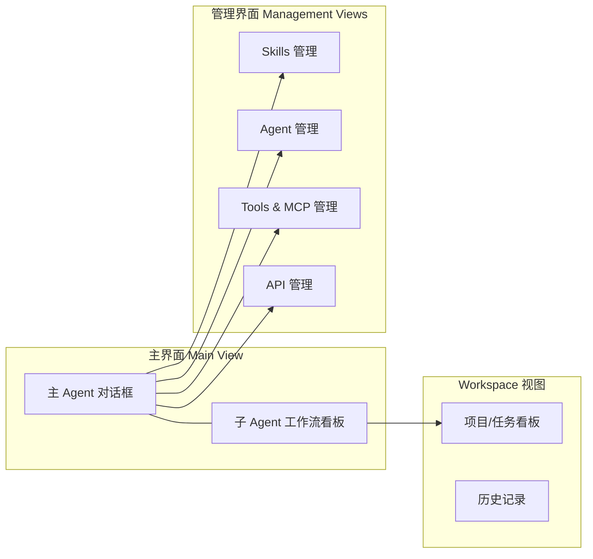

# TAgent — AI 办公协作助手：产品分析与实施方案

## 当前交付范围与目标回顾

2026-09-18 新授权八次复核：实际8次/峰时估算$0.0159438，批次已关闭。研究模型自评通过但人工发现日期未知被说成日期不同，项目草稿生成后被次数上限截停，均不记为完整内容验收。已补有限日期推断检查和完整场景最少4次余量准入，296项定向回归、类型及Core构建通过；本机已加载修复，数据配置不变，未继续扣费。证据与仍未完成的内容门槛见[本批记录](./docs/release-readiness.md#八次授权复核与修复2026-09-18)。

2026-09-18 GitHub交付闭合：主项目和三个独立开源工具已按用户要求分别上传并核对远端提交。主项目发布提交`dd7416d`在GitHub的Ubuntu/Windows环境均通过锁文件安装及`pnpm check`，不再把“未远程发布/未执行云端CI”列为缺口。没有npm发布、真实数据上传或新增付费调用；研究/项目完整报告的内容质量仍待复核，不以工程门槛替代内容验收。证据与边界见 [GitHub交付](./docs/release-readiness.md#github-交付与云端构建2026-09-18)。

2026-09-18 追加预算后的进度：独立16次/$0.20上限内实际14次、峰时估算$0.0295077，无本轮未知用量，旧账不清零。真实页面项目任务已完成最终报告、唯一SSE终态、保存与刷新，三栏拖拽、静态默认关系边和窄屏检查通过。研究/项目模型核对完整返回，但风险措辞仍有过强判断；已新增有限本地风险标题检查、247项相关回归和原回执离线重放，不改历史记录。余下重点是整份内容质量，不再重复扩展产品或以更多mock替代真实判断；详细证据见 [追加验收](./docs/release-readiness.md#追加授权与真实页面回查2026-09-18)。

2026-09-18 继续开发及必要验证：基于已有合成失败回执，补齐事实、材料缺口、条件性风险和建议的共同边界；项目角色与风险跟踪 Skill 不再将未知分工要求写成真实空缺。串行约束检查覆盖“若需缩短工期，可评估并行”，日期检查覆盖把日期缺失扩大为所有数字比较无效的表述。随后236项定向回归、Core类型/lint、Core/Server构建、18场景隔离办公接口通过；本机已加载修复，数据与配置哈希不变，无新增外部模型/搜索请求。本轮不声称重跑全仓或通过真实内容验收。当前各目标与具体剩余证据见 [目标交付核对](./docs/release-readiness.md#当前目标交付核对2026-09-18)，下方历史路线图不作为反复扩展范围的理由。

2026-09-18 必要验证与独立提取：上轮源码已完成四包类型/lint、AI/Core/Server及Web构建、101文件1487项回归、40项脚本自检、隔离办公接口与1440/390/320页面验证。修复运行状态误判、Explore子任务记录与异常脱敏、周期创建重试文本归一化，以及直接并行化建议绕过串行限制的问题。G盘本机前后端已启动，原会话/Skills/环境配置哈希不变。另在 `opensource/` 独立提取 Trace、确认导入和证据约束三个零依赖小工具，分别开任务完成，174项本地测试通过，不纳入主应用依赖、不自动发布。真实研究/项目内容质量仍按验收清单记录，不为此扩展Desktop、Docker、自动Merge或后台付费范围；本轮新增外部请求与费用为0。

2026-09-17 开发顺序更新：用户要求继续补齐已审查的缺口，先完成开发，最后统一验证。本轮已补入 Explore 实际检索入口、事件驱动运行状态、持久化周期待办、Loop快照保存与确认分支、治理依据回查及串行交付冲突检查的源码；**未运行测试/构建/浏览器或付费验收，未重启本机版本**。范围和待验证清单见 [运行、探索与快照](./docs/runtime-explore-snapshots.md)。周期待办不后台付费，快照不重放工具；高级递归、完整Cron表达式与无人值守调度、自然语言治理编译仍未完成，不把本轮开发等同全路线图完成。

2026-09-14 用户最新要求：持续回顾最初目标，交付符合项目目标的可行版本即可，不作过多延伸；额外增强以最后的后续计划提出，不默认继续实现。

初心保持为**面向非技术用户的可视化多 Agent 办公协作平台**。本阶段交付以单实例自托管 Web 版为准：普通用户能发起六类办公任务，得到可用结果和明确失败说明，看懂分工、来源、费用与审批；常驻/任务 Agent、Skill/MCP配置、会话保存与分支引用可用。不能只交付聊天壳、开发者日志或固定样例。

每轮开始对照原始架构、界面和验收要求，选择直接影响上述体验的工作；收尾记录用户收益、实际证据与剩余缺口。原定两个调研场景、六类角色基本交付、配置后实际使用、安全与数据不丢失仍需验收，不能用测试数量或文件下载代替真实使用。

下方完整路线图及历史记录保留，但不再把所有远期增强当作可行版本的前置条件。SaaS多租户、Desktop、Docker、自动Merge、Loop内进一步自主递归、复杂图表/PPT生成、大规模分布式与高级运行时等额外工作，先列后续计划。现有成果不回滚，也不为扩展这些能力继续增加普通用户操作负担。当前证据和具体缺口集中于 [验收清单](./docs/release-readiness.md)。

本轮回顾（2026-09-15至2026-09-16）：用户已允许同类模型/搜索验收，总额不超过$1，邮件仍不授权。授权后累计63次模型调用已知估算$0.2556645，另有1次此前超时保留$0.0351费用预留；此前3次历史未知费用仍单列，不以未知计零。本机G盘部署和可视化办公协作初心不变，不扩展Desktop、Docker、自动Merge或公网部署。已修复模型核对/算术、Skill样例污染和各执行阶段材料范围规则不一致；项目责任表有所改善，但风险行与研究语义仍有缺口，不能凭程序通过宣称内容完成。费用、证据与具体下一步见 [最新验收](./docs/release-readiness.md#最新授权与验收2026-09-15)。

## 当前增量记录

本地收尾（2026-09-16）：用户已选择暂不追加付费，先完成本地工作，本轮无新增模型/搜索调用。核对截断等情况现直接说明具体原因，无检查结果不再显示“0/0项”，Word导出与页面均保留内容覆盖和未完成状态。完整95文件1453项Vitest、40项脚本自检、四包类型/lint/构建及隔离API通过；16场景67次模拟请求和1440/390/320页面验收通过。新版独立Web与后端已恢复、原数据配置不变，测试资源已关闭。剩余真实内容及真实页面任务验收等待新的明确授权，不自行重置批次或扩展功能；当前不宣告整个目标完成。

当前验收补充（2026-09-16）：获准的最后一次同材料复核已执行，1次/$0.0161592，达到12288输出tokens上限而未形成完整JSON，不记为通过。原批次累计8次/$0.0535272，次数已用完，未自动重试。办公核对改为显式非思考模式及紧凑完整JSON，上限、预算和证据规则不变；新模式尚未真实复测。最新完整94文件1446项Vitest、40项脚本自检、四包类型/lint/构建及隔离API通过，零派发恢复的11项回归已纳入。行级核对、原稿、SSE与刷新及1440/390/320页面验收通过；测试资源已关闭，正式前后端已更新，原16会话/32消息、环境与Skills哈希不变。

下一步仅收尾：先根据已有失败回执验证研究/项目整份交付的语义和证据范围，再按明确外发授权及合并费用台账决定小额真实复测，最后做一次有界真实页面任务。不重置已用完批次，不新增产品模块，不把模拟模型或测试数量当成真实内容通过。下方为各轮历史证据。

> 表格逐行核对（2026-09-16）：办公核对新增版本化`table-rows-v1`，顶层Markdown表格按表头和数据行独立核对，问题可定位到具体行；历史回执继续使用旧编号，不改写旧结果。完整94文件1425项回归、40项脚本自检、四包类型/lint/构建及隔离API通过，办公接口15场景/64次本机模拟请求。随后仅验收脚本补充本地额度拒绝诊断，59项定向测试与脚本类型检查通过。本机新后端已恢复、用户数据/配置/Skills哈希不变。一次真实复核准备被本地费用预留拒绝，实际外部调用0、费用0，不算内容通过；浏览器启动审批超时，新增行级截图待验收。未扩展产品范围，下一步仍是研究/项目内容和真实页面任务收尾，详情见验收清单。

> 材料范围一致性（2026-09-16）：生成、汇总、核对和一次修订共用材料边界，不将局部岗位待定扩为全部无人负责，不将未知日期等同数字无法比较。用户确认具体合成项目材料与DeepSeek官方目的地后，7次调用/$0.037368完整结束，无新增未知用量；排期与责任表改善，风险行及修订新增错误仍被核对拒绝，未继续付费重跑。完整93文件1403项回归、40项脚本自检、四包类型/lint、构建和隔离API通过；本机恢复且数据/配置/Skills哈希不变。补完首页、历史三栏、管理页和1440/390/320只读浏览器验收，未提交任务或访问邮箱。后续先收尾风险行和研究语义，再做有界真实页面任务；不增加产品边界。

> Skill运行边界与差额核对（2026-09-16）：默认项目类Skills不再要求无依据的风险概率或人员分工；旧版/Package共用事实边界，独立测试文档和预期样例不注入真实任务，不覆盖用户保存的Skill。核对新增绝对差额操作，保留明确算式的方向与失败证据。最近11次付费调用已知$0.0360084，项目核对超时保留$0.0351预留且不重试；研究/项目内容仍未完全通过。完整93文件1401项回归、40项脚本自检、四包类型/lint、构建与全部隔离API通过；本机已恢复，16会话/32消息、配置和Skills哈希不变。本轮浏览器复查受工具审批超时影响未完成，临时浏览器已关闭。后续只收尾上述质量和页面验证，不扩展功能；下方计数均为历史记录。

> 当前模型与交付核对（2026-09-15）：默认DeepSeek改为当前可用的`deepseek-flash`，不覆盖显式配置；验收前预留费用并限制调用数，未知用量停止自动继续。无工具核对与工具循环采用不同思考设置，核对上限计入预算；算术按实际原文复算，错误核对不能静默改正正文。新公开来源报告返回日期/URL/可验证性，未核对的总结标题不再直接展示。原始草稿、失败记录和来源快照保留，邮件跳过；本轮不继续堆功能。下方“待授权”均是本次授权前的历史状态。

> 本轮收尾验证：完整93文件1390项回归、40项脚本自检、四包类型/lint、生产构建及隔离API通过。本机前后端已恢复，原16会话/32消息和环境配置哈希不变。本轮新增估算$0.1661289，无未结算新请求；内容缺口仍按最新验收条目保留，不把程序检查数量当作专业质量证明。

> 办公交付修订补齐（2026-09-15）：修复“部分引用无效时，已确认算术错误也无法修订”的中断点；仅在完整回执、有效段落及程序确定失败同时存在时使用原有一次修订，之后仍须完整重新核对。另修正“缩短3分钟”的幅度/方向误判，错误百分比继续失败。新增12项Core回归、2项本机SSE/保存/重启场景；完整93文件1352项测试、40项脚本自检、四包类型/lint、构建及隔离API通过。前后端已恢复，16会话/32消息与配置哈希不变，无外部模型/搜索/邮件调用。真实旧回执离线重放证明路径可达，不代表新报告内容达标；剩余真实质量复核仍待模型授权，不扩展原定产品范围。

> 手动验收额度保护（2026-09-15）：固定材料和报告重放脚本现在必须显式提供确认、调用数、记录费用阈值及验收目标，普通/流式请求共用计数；缺失或异常用量回执不按零费用处理，并阻止自动续跑，省略角色不再默认验收全部六类。43项定向离线测试及脚本类型检查通过；本次未执行模型或新增公开检索，未重启应用，会话/配置哈希不变，本机健康接口正常。此处仅补验收安全，不代表内容质量闭合；下一批模型额度仍待确认。运行方式见 [办公验收](./docs/office-delivery.md)，完整基础门槛仍以上一条搜索修复记录为准。

> 搜索误删与原文补读（2026-09-15）：直接提供方诊断实际返回10条候选，定位本地把“今天”算入主题、地区同义词缺失和独立“阅读原文”段落丢上下文三处问题。已修复并保留地区/主题约束与读取预算，真实复测取得5篇相关正文、2篇当天发布材料；有上游引用关系，不能当作独立互证或报告质量通过。完整92文件1307项回归、40项脚本自检、四包类型/lint、构建与隔离API通过，原16会话/32消息及配置哈希不变，本机服务已恢复。未追加模型调用；新报告与研究/项目/汇报内容复核仍待明确授权。过程和限制见 [搜索证据](./docs/research-search.md)，不扩展产品范围。

> 当天资讯修复（2026-09-15）：实际用户任务中的“今天”曾按近30天评估，现从原任务保留当日检索词，筛选、材料提示、最终核对和跨天恢复使用同一日期窗口；旧来源不升级为当日证据。公开探测仍未取得足够当天材料，另修复AI署名被当作AI主题的误判，保留原始失败记录，不改历史报告。新增21项回归，完整92文件1297项测试、40项脚本自检、四包类型/lint、构建及隔离API通过，新后端已恢复本机运行。无新增模型调用、不访问邮箱、不扩展功能范围；真实检索与内容质量仍按 [搜索验收](./docs/research-search.md) 和 [当前审计](./docs/release-readiness.md) 收尾。

> 本机内容复测修复（2026-09-15）：真实回执离线重放定位并修复减法顺序、“降幅”负号及用户排除日历日期的漏检，新增35项回归，失败/原稿/已知费用不改写。研究和汇报的推断过强仍待复核。授权公开搜索取得相关正文但一手/时效覆盖不足；验收与运行时共用最新日期窗口，旧资料不误标最新。完整门槛92文件1276项回归、40项脚本自检、四包类型/lint、生产构建和隔离API通过；排除本机生成目录的lint误扫描，新后端恢复，16会话/32消息及配置不变，浏览器桌面/手机只读验收通过。证据、额度边界和下一步集中于 [当前审计](./docs/release-readiness.md)，不以堆功能替代质量收尾。

> 本机交付复核（2026-09-15）：部署后补跑92文件1240项单元回归及40项脚本自检，全绿且未重启用户服务。实际加载六个Agent Card v2与原配置/文件数据。当前工程能力、已有真实证据和未闭合内容分别整理于 [本机交付审计](./docs/release-readiness.md)。仍需研究/数据/项目修复后的真实任务、汇报和AI新报告内容复核；邮件明确跳过，未收到新增授权不执行付费复测。额外功能继续留在后续计划，不以扩大范围代替当前验收。

> 首次安装更新（2026-09-15）：示例搜索配置不再默认锁定管理页，新模板复制后的默认值、确认保存和重载由实际文件/API回归覆盖；已有管理员锁定不放宽、不改写用户配置。README安装改为锁文件与禁用安装脚本，前后端从根目录在独立终端启动。完整91文件1235项回归、40项脚本自检、类型/lint、生产构建和隔离接口通过；本轮无真实模型或搜索调用。新源码候选采用r2名称，旧快照保留；尚未关闭的真实内容与部署门槛见 [清单](./docs/release-readiness.md)。

> HTTPS更新（2026-09-15）：新增独立生产前后端与一次性本机TLS验收，Cookie/WSS/SSE/历史及浏览器1440/390/320流程通过；不安装证书到系统信任库，不把测试代理作为生产代理。显式空`TAGENT_ENV_FILE`禁用文件加载，默认未设置行为保留，模型未配置断言前置。修复前3次超时检查可能误发模型请求，未收到用量，已停止且未重试；修复后验收模型调用为0。完整91文件1234项回归、40项脚本自检、四包类型/lint、生产构建与隔离API通过；测试发现范围不再扫描output中的源码副本。真实费用与完整发布缺口见 [清单](./docs/release-readiness.md)，旧源码ZIP仍是上一轮快照。

> 源码交付更新（2026-09-15）：新增白名单候选提取与SHA-256逐文件校验，拒绝覆盖、链接/硬链接、常见凭证、危险清单和内容变化，不复制`.tagent`、真实环境文件、Git历史、依赖或旧产物。408文件约3.8 MB源码在独立目录离线安装794个缓存依赖，下载0、禁用安装脚本；完整90文件1232项单元回归、39项脚本自检、四包类型/lint、生产构建及隔离API通过。原工作树源码与校验快照一致，后续文档补录证据；没有触发公开发布或真实模型调用。剩余内容、账户和目标环境验收仍按 [清单](./docs/release-readiness.md) 执行，候选生成不能自动宣布项目完成。

> 配置使用更新（2026-09-15）：Agent编辑器明确MCP绑定/调用权限、服务执行许可状态和Skill包内文本读取权限，勾选须保存、取消不生效，自定义白名单保留。MCP管理接口返回运行时同源toolName，伪造值不持久化；冲突可见且运行时仍拒绝。五场景25次本机SDK请求与真实文件存储/官方MCP SDK夹具贯通，浏览器1440/390/320下保存、取消、刷新、冲突、雷达和Skills侧栏通过；新增隔离脚本已纳入工程门槛。外部模型调用与用户数据写入均为0，不代表第三方工具、所有URL导入或真实模型选工具质量已全面合格，详见 [发布校验](./docs/release-checks.md)。

> 已知条件核对更新（2026-09-15）：新增58项回归，覆盖明确串行条件和同量词包含关系、引用/假设/未来变更/不同来源/负数反例，以及模型误判不能覆盖本地失败、预算不足或接口异常保留问题。原真实记录离线重放识别研究3处、项目1处问题，周报不受影响；新增办公接口门槛10场景41次本机SDK请求，修订、SSE、保存和重启一致。最终`pnpm check`为90文件1232项单元测试、25项脚本测试，四包类型/lint、生产构建及全部隔离接口通过。浏览器检查成功/失败、原稿、刷新、1440/390/320布局通过，专用浏览器与临时服务已关闭。没有新增付费调用、安装或用户配置写入；这只修复具体漏检，不替代真实模型语义质量验收，见 [办公核对边界](./docs/office-delivery.md)。

> 真实验收更新（2026-09-15）：两个调研约242/252秒收尾，分别85/100条WorkflowEvent，支付历史图12节点/21边默认可见、无节点重叠。六角色批次共24次模型调用：文档基本交付通过；研究/项目人工抽查仍有问题；数据计算正确，Unicode负号解析已修复并以原回执离线重放5个算式；邮件仅规划、汇报未执行即达到验收器上限，未自动加码。完整`pnpm check`为89文件1174项单元回归、25项脚本测试、四包类型/lint、生产构建及隔离API验收通过。当前已记录费用约$0.45474245（本地估算，非供应商账单）；详细证据和未完成项见 [验收清单](./docs/release-readiness.md)。

> 验收准备校正（2026-09-14）：旧六角色脚本禁用全部工具、仅匹配数字，不能证明新增数据能力。数据题现使用原始CSV及默认白名单内的只读表格工具，核对原文指纹、完整汇总和两次比较回执；调研和六角色脚本都要求明确`--live`开关。15项新增离线检查与5项数据编排回归、全量89文件1161项单元回归和脚本类型检查通过；未重跑生产构建，不是实际模型成绩。没有扩展产品功能或发起付费调用；真实搜索、调研和六角色交付仍待确认后验收。

> 请求保护更新（2026-09-14）：HTTP读取、写入、联网操作和停止/审批分开限流，429明确等待时间，任务未接收恢复草稿；新会话准备失败不再生成假回复。WebSocket补齐连接数、握手/消息频率与原生16KiB正文/分片限制，重复加入会话清理旧订阅。39项限流与2项草稿回归、独立HTTP/WebSocket、浏览器桌面/手机及完整88文件1146项门槛通过。不是DDoS、跨实例互斥、费用硬上限或公开部署认证。见 [访问保护](./docs/self-hosted-access.md)。

> Word 交付更新（2026-09-14）：已结束的单条回复支持手动下载可编辑DOCX，保留正文层级、表格、脚注、来源与核对摘要，失败/中断/保存未知状态不包装成成功。浏览器本地转换，不调用模型或网络；修复旧正文解析器压平嵌套列表与丢弃表格尾列的问题。新增21项回归，完整87文件1105项测试与工程门槛通过；隔离运行7场景26次本机请求、5次实际下载、桌面/手机/暗色及4份文件9页原生Word渲染通过。不是DOCX输入、全格式附件、真实六角色质量或上线完成，原定全部开放门槛保留。见 [回复与 Word 交付](./docs/report-export.md)。

> 表格输入闭环更新（2026-09-14）：数据任务新增XLSX/CSV/TSV读取预览、工作表/范围选择和确认追加材料，原文件不落盘，不提前调用模型；保留原有草稿与手动发送。补齐日期、精度、编码、公式缓存/错误、隐藏内容、XML与压缩包边界，46项定向回归及真实文件浏览器链路通过。选区经过实际计算、SSE和持久化后可下载Excel，独立回读/渲染与桌面/手机/暗色检查通过。此为有界表格输入，不是通用附件存储、真实模型办公质量或全部上线验收；原定搜索、六角色交付、治理/Session/Runtime和发布要求继续保留。见 [数据分析](./docs/data-analysis.md)。

> Excel 交付更新（2026-09-14）：回复及历史事件中的实际表格回执支持手动下载 XLSX，包含全部分组、已有比较/异常和口径；字段样本明确限量。普通数值可继续计算，超出Excel精度的结果保留文本，缺失/异常不改为零，不写公式、宏或外部链接；导出不重跑任务。新增19项独立ZIP/XML回读测试，桌面/手机下载与失败重试通过，四类实际下载文件已回读和渲染检查。它是单次工具结果快照，不是完整业务工作簿、附件输入或原生Excel兼容认证；六角色真实交付、默认搜索和全部发布要求继续保留。见 [数据分析](./docs/data-analysis.md)。

> 数据能力更新（2026-09-14）：数据 Agent 已接入绑定用户原文的只读表格工具，支持CSV/TSV/Markdown、十进制分组统计与明确基期的变化率；不接受模型重录数据，不执行公式，不覆盖用户绑定。实际回执进入办公核对和统一WorkflowEvent，随会话/检查点保存。回复新增默认折叠的计算记录，与分页执行记录共用展示；窄屏直接呈现结果/异常，长名称可展开，浏览器可在不请求模型或网络的情况下核对完整原文指纹。59项定向回归、五场景本机SDK/SSE/重启及桌面/手机/暗色浏览器验收通过；不能替代真实模型选区、办公质量、附件/图表或全部上线验收。说明见 [原始表格分析](./docs/data-analysis.md)；用户默认搜索配置未改，原路线图和其余门槛不变。

> 原文追溯更新（2026-09-14）：调研搜索页与引用原文共用最多8页的读取额度，引用最多4页/两层，覆盖后续批次并保留来源链。短引用只借助父正文发现候选，不能继承日期、相关性或权威；HTTP错误/拒绝页不得当作正文。报告核对识别未写入最终引用的中间转载关系，材料包区分真实读取状态；同一最终页面去重，保留实际请求入口和版本参数，不将canonical标签当作真实跳转。相关114项定向回归通过，真实AI任务已追到原始地址但遇到验证拦截，支付主题仍无相关材料；后续对照查询确认本机Bing页面回显正确却返回偏题内容。用户明确确认前不切换搜索服务，不标记调研闭环或上线完成。测试、完整边界和后续实测见 [调研搜索](./docs/research-search.md) 与 [上线清单](./docs/release-readiness.md)，下方历史记录及全部原目标保留。

> 默认搜索更新（2026-09-14）：修复英文主题后备继续使用国内结果的问题，HTTP/浏览器使用同一Bing国际结果查询，保留当前年月、显式检索条件与原主题过滤；跳转改词拒绝采纳。真实AI主题由0变为5条候选，正文有4个窗口内日期来源，但未取得确认一手源；支付主题仍无相关候选，因此不标记真实调研闭环完成。新增免费手动验收选项，不改用户配置、不调用模型。证据见 [调研搜索](./docs/research-search.md)，原目标、其余发布门槛和下方历史记录均保留。

> 模型诊断更新（2026-09-14）：管理中心增加独立的模型配置与连接测试入口，替换首页固定绿色在线标志。预览免费且不落盘，费用确认后只发送一次固定短文本；结果与已知用量持久保存，取消、响应不明、写盘失败和重启不自动重跑。24项管理器回归、两种实际SDK的8次本机请求、浏览器5种场景及桌面/手机/暗色截图通过；完整 `pnpm check` 为79文件905项回归、25项脚本测试、四包类型/lint、生产构建及隔离HTTP/恢复验收。此结果不证明真实账户已连通，不改变默认搜索源，也不代替原定调研、六角色办公质量和全部上线要求。说明见 [连接诊断](./docs/model-connection.md)，完整开放项仍见 [上线清单](./docs/release-readiness.md)。下方各轮数字为历史记录。

> 数据恢复更新（2026-09-14）：新增文件模式离线备份、清单/哈希验证和仅新目录恢复；必须操作者确认停写、文件模式与私有数据范围。恢复撤销旧MCP执行授权，不完整目录拒绝启动；不停止用户服务、不调用模型、不复制现有用户数据。22项备份测试、隔离生产后端的中文/Trace/Fork/设置恢复通过，完整门槛为78文件881项回归及25项脚本自检。前一轮SSE接收也已完成128事件分批更新、193事件原生流和手机日志验收，不丢材料或终态。详见 [备份恢复边界](./docs/data-backup.md) 与 [工作流验收](./docs/workflow-performance.md)。在线一致性、数据库/主机故障恢复、真实办公交付、默认搜索、治理/运行时和全部发布要求仍未完成；下方数字为历史记录。

> 长任务工作流更新（2026-09-14）：保留列表虚拟化、关闭卸载、滚动恢复和全量搜索。全部关系由React Flow维护，共享SVG承载静态线和箭头，Canvas批量绘制流动效果；补齐长工具/综合关系裁剪、全景缩放与线宽适配。3,099条事件、219节点/432边的最终生产样例中，默认/末尾/全景及滚轮平移平均约16.7–16.9ms、P95不超过17ms；仅证明本机固定样例，不能标记跨设备性能或上线验收完成。原生SSE父子任务、持久结果、手机和减少动态效果回归通过；完整门槛78文件870项回归通过。证据、测试读回干扰说明与剩余门槛见 [长任务工作流验收](./docs/workflow-performance.md)。下方轮次证据为历史记录。

> 工程门槛更新（2026-09-13）：新增 `pnpm check`，按依赖顺序完成构建、四包类型与全量 lint、77文件858项回归、3项校验器自检、生产构建及隔离 HTTP/模型错误/中断恢复。当前目录及不含旧产物、用户数据和 `.env` 的 Windows 副本均通过；合并 workspace 配置，修复工作流渲染/视口状态与搜索设置加载，原生 SSE、手动收起、桌面/手机回归通过。已添加 Windows/Linux CI 定义，但未在云端运行。源码发布前仍需核查已跟踪的私有运行文件；真实六角色交付、默认调研源、性能、治理/运行时和部署门槛均未关闭。步骤与边界见 [构建与发布校验](./docs/release-checks.md)。下方轮次证据为历史记录。

> 办公核对更新（2026-09-13）：核对请求使用逐段 JSON 模板，字段无效不再抹掉全部有效检查；原始核对/修订返回和已知用量可回查，缺项仍不判通过。已接入任务检查点，取消、进程结束、重启和写盘失败不自动重跑，不把半份修订替换原稿。77文件856项回归、六类办公协议/九类停止恢复、实际SDK及桌面手机验收通过，详见 [办公交付核对与中断回查](./docs/office-delivery.md)。本轮无付费模型调用，历史缺失回执不能补造；真实六角色质量、默认调研来源、管理中心/治理/运行时和全部发布门槛继续保留。下方各轮测试数量为历史记录。

> 摘要分支更新（2026-09-13）：已接入保留原文、外发/费用预览、显式确认、单次调用及来源会话费用记录。先保存操作和模型结果，再原子创建分支；存储故障只补本地保存，取消/重启不自动重跑。两种实际SDK的6次本机请求和浏览器3次请求覆盖防重、原文、取消、磁盘故障、恢复及1440/390/320布局；全仓77文件826项回归通过。原有连续对话/引用的29次本机请求仍通过，详见 [连续对话与分支引用](./docs/session-context.md)。没有新增付费调用；摘要选材完整性、真实多轮质量、统一成本聚合、长历史检索及全部上线门槛继续保留。

> 执行记录索引更新（2026-09-13）：统一WorkflowEvent已接入按run的JSONL与字节偏移索引，历史明细按需分页和协作者/行为筛选，旧路径拼接查询已移除；索引可从原始消息重建，不阻断最终报告或审批。132条记录、重启游标、两个SSE入口一致性、目录/归属防护和1440/390/320浏览器验收通过，当前70文件778项回归通过。架构图仍使用完整事件，同名工具标签已去重。详细证据与限制见 [执行记录与索引](./docs/trace-history.md)。这不是全量会话载荷分页、数据库索引、不可篡改审计或完整性能验收；真实办公质量、Session/Runtime和全部发布门槛继续保留。下方早期“尚未接入JSONL索引”等为历史进度。

> 工具确认与治理回查更新（2026-09-13）：逐次审批已接入 Orchestrator、联网预调研、SSE 与对话界面。suggest 要求确认，auto_edit 仅对受信内置本地只读工具免逐次确认；不再三秒自动批准。决定保存后才授予许可，超时/取消/保存失败不执行，重启不复活审批。治理页直接读取同一组 WorkflowEvent，兼容旧版历史、去重 Fork，展示来源、筛选分页和已记录成本。752项回归、七场景隔离HTTP/重启、访问保护和桌面/手机验收见 [工具确认边界](./docs/governance-approval.md)。用户历史中的108条治理记录已可读回，没有改写原文件。尚不是独立审计档案、JSONL索引、跨用户审批或完整治理决策系统；真实办公交付和全部上线门槛继续保留。

> 受控评测闭环更新（2026-09-13）：八题实跑已接入Server与大厅，外发/费用预览和5分钟一次性确认、单实例单评测准入、进度/取消/历史、重启中断与零自动重放均已落地。完整且成功保存、配置/Skill/题库/模型/服务地址匹配的成绩才用于雷达；保留免费配置检查与Skills拖拽侧栏。733项回归、隔离HTTP/磁盘故障/浏览器和桌面手机截图通过，详见 [评测边界](./docs/agent-benchmark.md)。没有调用付费模型，固定材料题不代表真实办公质量，其他上线门槛仍未完成。下方早期“尚未接入”记录为历史进度。

> 受控题库内核更新（2026-09-13）：新增7道基础材料题与1道角色字段题，复用Agent Loop/Soul/Skills/白名单，以结构化金标准和真实工具记录评分；需预览指纹一致且显式确认，有调用/上下文限制、取消和保存失败/超时停止保护。714项回归与两种SDK/六角色的隔离协议验收通过，详见 [评测边界](./docs/agent-benchmark.md)。尚未接入大厅运行/取消/历史接口，未进行真实模型质量验收，不代表真实联网、MCP、开放式办公质量或外部榜单能力；原计划和所有发布门槛保留。

> 评分可信度更新（2026-09-13）：大厅雷达使用统一0–100配置评分，配置检查不再标成实测；已保存任务的回执、工具请求、权限与交接单独复核，不以 URL/日期字样冒充事实验证。新增独立持久记录、配置指纹过期检测、历史与来源导航；保存失败不覆盖原记录，打开页面不触发模型或保存。682项回归、隔离 HTTP/重启和桌面/手机验收见 [上线清单](./docs/release-readiness.md)。这不是已完成真实 Benchmark 题库：8–12题实跑、交付物金标准、模型/Skill/MCP版本证据及原有全部发布门槛仍需完成。

> 当前稳定性更新（2026-09-13）：保留模型请求时限、错误脱敏与综合失败材料；新增单会话任务防重、单进程容量限制和 UTF-8 输入上限，明确拒绝时恢复草稿。真实 HTTP 与跨标签页原生 SSE 验收通过，超大/分块请求不进入任务处理，多行输入适配手机。当前651项回归及具体证据见 [上线清单](./docs/release-readiness.md)。不是自动队列、跨实例互斥或费用硬限额，也不证明真实账户连通和六角色办公质量；原有全部发布门槛继续保留。

> Discovery 更新（2026-09-13）：搜索与导入共用有界 GitHub 缓存/请求队列，限流按真实响应暂停；直接 URL 不作关键词外发，npm 增加相关性筛选。真实 Skill 六文件包与 MCP 配置选择预览通过只读验证；两页明确区分搜索成功、缓存和限流，修复 Skill 窄屏搜索栏裁切。575项回归及隔离 HTTP/浏览器验收见 [上线清单](./docs/release-readiness.md)。搜索成功不等于包可运行；六角色真实办公交付、治理/Trace、Session、Runtime 与发布门槛仍未完成，原目标和边界不变。

> MCP 运行与导入更新（2026-09-12）：官方 SDK 握手、工具调用、配置保存与独立执行授权保留。新增真实 JSON/JSONC/README 配置解析、GitHub 固定提交文件选择、npm 发布版本/入口核实与对应 README 参数读取、Registry v0.1 发现和配置解析；多方案先选、凭据重新填写、确认前零写入零执行。535项回归、真实公开元数据及隔离 UI/HTTP 验收见 [上线清单](./docs/release-readiness.md)。真实 GitHub 重测出现限流，页面已如实报错；其他包运行环境、OAuth、细粒度审批、任务内持久会话与全部办公/发布门槛仍开放。

> Skill 导入更新（2026-09-12）：已分离搜索、目录选择、真实预览和确认保存。GitHub ref/path 保留，固定提交读取 SOP 与附属文件，不再以 README 或失败占位内容冒充 Skill；资源按需读取服从 Agent 白名单，脚本不执行。真实 last30days-skill-cn 预览/隔离保存/刷新与多 Skill 仓库选择、桌面和手机验收通过；50个文件485项回归、类型与生产构建通过。超限附件仍未导入，MCP 配置解析、完整包运行环境、真实办公交付与其余发布门槛未完成，详见上线清单。

> 子 Agent 闭环更新（2026-09-12）：主 Agent 的初始任务计划可请求受控两层分工，继承并收紧父配置，任务历史和完整输出提交成功后才发布，重启仅标记中断、不自动重跑。大厅可查看实际状态、来源和输出，确认后复制为独立常驻 Agent，保留原任务与父子 Trace。455项回归、隔离 HTTP 与浏览器 SSE/三栏/手机/保存验收通过；不是 Agent Loop 内自主递归，也不代替真实模型分工、硬预算、规模化历史或完整上线验收。所有尚未完成门槛仍见 [上线验收清单](./docs/release-readiness.md)。

> 当前增量验收（2026-09-12）：办公交付接入逐段材料核对和已登记长度/算式的程序复算，未通过最多在预算内修订一次，保留原稿与失败项。Skill 清单进入核对阶段并影响终态；核对中取消不丢单 Agent 已完成原稿，内部核对 JSON 不覆盖恢复草稿。隔离 HTTP、真实浏览器 SSE、重启与1440/390/320宽度验收通过；工作流入口移至页头，保留三栏、拖拽和默认关系边。全量436项回归通过，不能代替真实六角色内容验收；本轮付费模型验收尚未获得外发授权，未运行。Agent 配置持久化成果保留，继续六角色真实交付、子 Agent 历史回查、Skill/MCP 实际导入执行、治理/Trace/Session/Runtime与完整发布门槛，详见上线验收清单。

> 2026-09-11 接手核验：原路线图保留。逐项上线门槛、已验证证据和未完成工作见 [上线验收与后续开发](./docs/release-readiness.md)。文件持久化与重启、单实例访问保护已通过基础验收；两个原定调研任务已在最新隔离运行中通过原文支持性和交付检查，仍不代表完成独立事实核查或用户默认环境验收。下文的历史实现概况不能代替当前验收。

> 工作流补充验收：真实长任务的 114 条事件、27 次工具调用、实际参与 Agent 与依赖关系已通过历史回放检查，三栏拖拽及手机收起可用。任务实例级 Trace、不可变配置快照、实时与大图性能仍未验收；支付调研最新复跑仍因 3 条结论证据不合格而降级。具体记录和完整后续门槛仍以上述验收清单为准。

> 后续核验更新：新增折叠来源核对面板，历史记录、原文与有效来源链接可查看；输入框不再覆盖消息滚动区。此前126条事件的支付任务及其13节点/19条边通过工作流回放，但内容验收失败。默认搜索源曾无可用候选；现新增需显式启用的 Parallel 搜索通路，两个原定主题的候选与正文读取实测通过，未自动改变用户配置。独立后端两次完整调研均正常收尾、SSE与存储一致，但内容仍未通过；发现并修复了结论数量超限只报“结构不完整”的反馈问题，保留全部证据门槛。当前239项回归、四包类型检查和构建通过，不代表可以公开上线。详见上线验收清单，继续完整调研、真实工作流与六角色办公交付验收。

> 最新验收补充（2026-09-12）：原文段落与事实交付误判修复后，隔离 AI/支付完整任务分别6/5条结论通过支持性与交付检查，仍不等于独立事实核查。本轮新增“调研搜索”管理入口，外发确认、测试、保存分开，运行中固定搜索源；真实 HTTP 重启、浏览器 fixture 及手机/暗色布局通过，独立真实测试路由取得10条相关候选，未修改用户设置。当前280项回归、四包类型检查及构建通过，用户主服务仍为 `auto`；真实工作流、原始来源追溯、六角色交付和正式发布门槛继续以上线验收清单为准。

## 一、我的总体看法

> 会话隔离更新（2026-09-12）：会话独立持有消息、草稿、SSE 和停止状态；页面内切换会话/进入管理中心保留原任务，迟到历史响应不覆盖其他会话或较新的结果。保存失败保留本地回复，退出/登录过期清除私有状态并断开自有任务；Fork 立即展示复制消息。执行记录默认折叠，中文输入法 Enter 不误发送。18项会话回归、全量363项测试、前端类型/生产构建及1440/390宽浏览器验收通过。真正刷新仍由后端断连收尾，不是自动续跑；跨标签页协作、长期缓存/大图性能、真实办公交付及完整发布门槛继续保留。

> 中断恢复更新（2026-09-12）：提问与运行标记原子保存，执行中记录来源、子任务全文、WorkflowEvent 和已收到的模型用量；重启后恢复为明确的中断报告，不自动重跑工具/模型。准备好的最终报告可仅补做保存，重复重启不重复消息或费用；Fork 复制历史但不复制运行控制归属。隔离后端三类强制终止、重复重启及桌面/手机恢复验收通过，345项回归通过。仍须补齐主机/存储故障、多实例互斥、跨会话运行体验、真实办公交付、管理中心和完整发布门槛，详见上线验收清单。

> 任务停止更新（2026-09-12）：两个运行 API 共用受控生命周期，前端停止按钮连接后端取消；模型、搜索、浏览器及已启动 stdio MCP 接入取消信号。隔离 HTTP 验证规划/工具后/综合中取消、真实断连、总时限、写入故障及重启保存；桌面和手机按钮验收通过。334项回归、四包类型与构建通过。此结果不等于进程强杀恢复、任意外部脚本隔离或全部上线门槛通过，详见上线清单；不修改用户搜索来源，不隐性调用付费模型。

> 工作流阅读与小屏更新（2026-09-12）：静态图默认可读比例，增加节点定位/显式全景并保留同 run 阅读位置；小屏导航改为按需抽屉，桌面保留三栏和拖拽。修复工作流使用未定义主题变量导致透明叠字，以及浮层层级和综合关系边穿卡。隔离原生 SSE、桌面/手机/横屏/暗色浏览器验收通过，320项回归与前端类型/生产构建通过；200+节点性能、真实办公任务、完整可访问性、运行时安全与部署门槛仍开放，详细证据以上线清单为准。

> 浏览器交互补充（2026-09-12）：修复去重后的快照编号与点击/输入目标不一致，改为已观察元素引用；刷新和 DOM 改变后拒绝旧编号，滚动后能观察新区域。同一任务浏览器命令串行、跨任务页面隔离，真实 Chromium 受控页面验收通过，未调用模型或放松私有地址规则。当前319项回归与四包类型检查通过；真实办公交付、完整交互审批/取消、工作流阅读体验、管理中心闭环和部署门槛仍开放，不能以元素定位正确替代整体验收。

> 工作流与运行隔离更新（2026-09-12）：子任务事件与能力记录已贯通 Core、两个 SSE API 和工作流三视图；同一 Agent 的执行实例分开，历史配置不再随大厅改动。隔离模型/真实后端与原生浏览器 SSE 的35条事件、10条默认关系边、刷新/重启一致性通过，发现并修复了节点详情无法点击和 SSE 缺少 UTF-8 声明。浏览器会话已改为任务持有并在结束时清理。当前298项回归、四包类型及构建通过，仍不代表公开上线；接下来重点是浏览器引用准确性、真实并发页面、静态图文字可读性、手机导航、大图性能及完整办公闭环，范围与剩余门槛见上线清单。

这个项目方向**非常正确且时机恰当**。原因如下：

1. **市场空白明确**：当前的 agent 产品（Claude Code、Codex CLI、Aider 等）几乎全部面向程序员，非技术用户被完全忽略
2. **可视化是核心差异化**：将 agent 的"黑盒"变成"玻璃盒"，这是建立用户信任的关键
3. **架构参考成熟**：Hermes、OpenClaw、Claude Code 的架构已经被验证，可以站在巨人肩膀上

但也有需要警惕的地方：

> [!WARNING]
> **范围风险**：你描述的功能集非常庞大（多 agent 编排 + 实时可视化 + Skills 管理 + MCP/API 管理 + Workplace 管理）。需要严格分阶段，否则容易陷入"什么都想做，什么都没做好"的困境。

> [!WARNING]
> **交互复杂度 vs 目标用户**：目标是非技术用户，但 agent 编排、skills 自定义、MCP 配置等本身就是复杂概念。需要在"强大"和"简单"之间找到精确的平衡点。

---

## 二、从参考架构中提取的关键模式

### 2.1 从各参考项目中学到什么

| 参考项目 | 核心启发 | 我们要借鉴的 | 我们要改进的 |
|---------|---------|------------|------------|
| **Hermes** | Skills 自学习系统（成功→提炼→复用）、持久记忆、五大支柱架构 | ✅ Skills 自归纳、✅ 持久记忆、✅ 身份/灵魂组件 | 🔄 CLI-first → 我们 Web-first |
| **Hermes-Team** | SSE+WebSocket 双通道实时通信、**多维 Agent 状态模型**、团队导出/脱敏 | ✅ 双通道方案、✅ 多维状态驱动 UI、✅ `request_human_input` 用户升级 | 🔄 我们增加治理引擎层 |
| **OpenClaw** | 三层架构（Channel→Brain→Body）、**Heartbeat 巡检**、Cron 定时任务 | ✅ 分层解耦、✅ Heartbeat 主动调度、✅ Skills Markdown 定义 | 🔄 单 Agent → 我们多 Agent 递归裂变 |
| **Claude Code** | 动态 Prompt 组装、**隔离上下文+摘要返回**、三层记忆、**并行 Explore Agent** | ✅ 子 Agent 隔离上下文、✅ Explore 只读模式用低成本模型、✅ 三层记忆 | 🔄 子 Agent 不能递归 → 我们支持递归裂变 |
| **OpenCode** | Plan/Build 分离、**JSONL append-only 事件日志**、**Snapshot 撤销**、裂变=工具调用 | ✅ 先规划再执行、✅ Trace 用 append-only 存储、✅ 执行前快照可回滚 | 🔄 已归档，架构设计值得参考 |
| **Codex CLI** | **App Server 解耦**（Agent Runtime 独立于 UI）、**三级审批模式**、沙箱安全 | ✅ Runtime-UI 解耦、✅ 审批映射到治理约束严重度、✅ 沙箱执行 | 🔄 终端 → Web 体验 |
| **Pi** | **四层 Monorepo**（AI抽象/Agent Core/场景/UI）、LLM 内建成本追踪、**树形会话历史** | ✅ 分层 Monorepo 结构、✅ 成本数据喂治理引擎、✅ 树形历史=Session Fork | 🔄 我们增加可视化和治理 |
| **Agent-Browser** | Snapshot+Refs 大幅降低 token、**AI 原生浏览器自动化** | ✅ 内置浏览器 Tool（非独立 Agent）、✅ 安全治理配合（URL 白名单） | 🔄 集成到 Agent Loop 能力层 |

### 2.2 从可解释性 AI 领域学到什么

| 项目/方向 | 核心启发 |
|----------|---------|
| **LangGraph** | 将 agent 工作流建模为有状态循环图，可视化每步决策路径 |
| **VectorInstitute/Agentic-Transparency** | "设计时透明"和"过程时透明"的方法论 |
| **Motia** | "可视化后端"概念——实时展示 agent 行为和 job 执行 |
| **迭代看板(Iterative Kanban)** | 将人-agent 反馈循环作为一等公民而非线性步骤 |
| **A2A Protocol** | Agent 间标准化通信协议（Linux Foundation），Agent Card 能力发现 |
| **LangGraph Studio** | 时间旅行调试——设置断点、修改状态、从检查点恢复执行 |

---

## 三、创新架构设计

### 3.1 整体架构



### 3.2 Agent 二态模型 + 裂变通用能力

| 概念 | 说明 | 类比 |
|------|------|------|
| **🟢 常驻态 (Resident)** | 固定通用 Agent 始终待命 | 公司核心部门 |
| **🟡 任务态 (Task-Spawned)** | 根据任务动态创建，完成后可归档或转为常驻 | 项目组 |
| **⚡ 裂变 (Fission)** — 通用能力 | **所有 Agent 都具备的能力**，无论常驻还是任务态。当任务复杂时可自主创建子 Agent，子 Agent 也可继续裂变，形成递归树。结果逐级上交。 | 任何部门/项目组都能拆分小组 |

> [!IMPORTANT]
> 裂变不是第三种 Agent 类型，而是**所有 Agent 的内建能力**。常驻的"文档助手"也可以裂变出子 Agent 来并行处理一份长文档的不同章节。

### 3.3 Agent 生命周期



### 3.4 Agent Loop 内部结构（系统心脏）

每个 Agent 的执行循环遵循统一的 7 步结构。**治理引擎在步骤④作为 Hook 内嵌**，而非外挂。



**来自参考项目的关键增强**：
- **⓪ 状态快照**（← OpenCode）：每次迭代前保存快照，治理拦截时可回滚到上一步
- **③d Explore 模式**（← Claude Code）：用低成本模型（如 Haiku）进行只读探索，不消耗主模型预算
- **JSONL append-only Trace**（← OpenCode）：Trace 数据用追加写入，O(1) 性能，不重写文件

### 3.5 Agent Card（标准化身份描述）

每个 Agent 具有标准化的 Agent Card，支撑治理检查、静态视图渲染、拖拽管理。

采用**声明式定义**（← Claude Code `.claude/agents/` 模式）+ **多维状态模型**（← Hermes-Team）：

```yaml
agent_card:
  id: "agent-doc-001"
  name: "文档助手"
  type: resident           # resident | task_spawned
  description: "文档生成、编辑、格式化"
  soul: "SOUL.md"          # 人设定义文件（← Hermes-Team）
  
  capabilities:
    skills: ["weekly-report-gen", "proofreading"]
    tools: ["markdown-editor", "browser"]  # 浏览器作为内置工具
    mcp_servers: ["notion-connector"]
    
  constraints:              # 治理引擎读取此字段
    max_fission_depth: 3
    max_cost_per_task: "$1"
    allowed_data_sensitivity: "low"
    approval_mode: "suggest" # suggest | auto_edit | full_auto（← Codex CLI 三级审批）
    
  state:                    # 多维状态模型（← Hermes-Team）
    business: idle           # idle | busy | waiting
    runtime: running         # stopped | running | error
    human_interaction: idle  # idle | waiting_human
    orchestration: none      # none | waiting_workers | fissioned
    
  heartbeat:                # 主动巡检（← OpenClaw）
    enabled: true
    interval_minutes: 30
    checklist: "HEARTBEAT.md"
    
  stats:
    tasks_completed: 142
    avg_quality_score: 0.91
  parent: null
```

**多维状态如何驱动 UI**：
| 状态维度 | 驱动的 UI 元素 |
|---------|---------------|
| `business` | 工作流节点动画（脉动/静止/等待旋转） |
| `runtime` | 健康状态指示灯（绿/红/灰） |
| `human_interaction: waiting_human` | 弹出用户决策卡片 |
| `orchestration: fissioned` | 节点展开显示子 Agent 树 |

### 3.6 Observability Trace 数据模型

所有可视化均消费此统一数据模型。采用 **JSONL append-only** 存储（← OpenCode），O(1) 写入性能：

```yaml
trace:
  trace_id: "tr-001"
  agent_id: "agent-doc-001"
  session_id: "sess-abc"
  parent_trace_id: null     # 裂变时指向父trace
  snapshot_id: "snap-001"   # 关联的状态快照（可回滚）
  spans:
    - { type: "snapshot", state_hash: "abc123" }
    - { type: "planning", summary: "策略：先拉Jira数据再生成报告", tokens: 700, cost: "$0.003" }
    - { type: "tool_call", tool: "jira-connector", duration_ms: 3400 }
    - { type: "explore", model: "haiku", query: "搜索竞品数据", cost: "$0.0003" }
    - { type: "browser_action", url: "https://jira.company.com", action: "extract_data", screenshot: "snap-002.webp" }
    - { type: "governance_check", policy: "resource.budget_cap", result: "passed" }
    - { type: "fission", child_agent_id: "agent-doc-001-sub-1", reason: "并行处理不同章节" }
    - { type: "output", confidence: 0.89, quality_check: "passed" }
```

### 3.7 实时通信架构

采用 **SSE + WebSocket 双通道**（← Hermes-Team 验证方案）：

| 通道 | 用途 | 持久化 |
|------|------|--------|
| **SSE** | 结构化事件（任务创建、状态变更、治理事件、完成通知） | ✅ 持久化到数据库 |
| **WebSocket** | 高频流式输出（Agent 运行时的 token 流、实时日志） | ❌ 不持久化 |

Agent 间通信采用标准化消息（参考 A2A 协议），消息类型：

| 消息类型 | 方向 | 用途 |
|---------|------|------|
| `TaskRequest` | 父→子 | 委派任务，含目标、上下文、约束 |
| `TaskProgress` | 子→父 | 进度汇报，含状态和中间结果 |
| `TaskComplete` | 子→父 | 完成汇报，含**摘要结果**（← Claude Code 隔离上下文+摘要返回） |
| `TaskFailed` | 子→父 | 失败汇报，含原因和已尝试方案 |
| `GovernanceEvent` | 治理引擎→Agent | 约束检查结果通知 |
| `HumanInputRequest` | Agent→用户 | 请求用户输入（← Hermes-Team `request_human_input`） |

### 3.8 Skills 自学习系统（借鉴 Hermes）



**Skills 的数据结构**（借鉴 Hermes + Superpowers 格式）：

```yaml
---
name: weekly-report-generation
description: 生成团队周报，汇总本周工作进展和下周计划
category: 文档
trigger: 用户提及"周报"或"weekly report"
confidence: 0.92  # 历史成功率
created_from: task-2025-0531  # 来源任务
---

## 前置条件
- 需要访问项目管理工具（Jira/Notion）
- 需要本周的 commit/PR 记录

## 执行步骤
1. 从项目管理工具拉取本周 completed 任务
2. 从代码仓库拉取本周 PR 合并记录
3. 按模板生成周报草稿
4. 发送给用户审核

## 使用的工具
- MCP: jira-connector
- API: github-api
- Tool: markdown-formatter
```

### 3.9 Session 管理与分支引用系统

#### 三种创建方式



| 方式 | 上下文 | 适用场景 | Token 消耗 |
|------|--------|---------|-----------|
| **① 新建** | 空白（可选继承其他 Session 的摘要） | 全新任务 | 无 |
| **② 完整复制 Fork** | 完整复制当前上下文 | 精细分支探索、需完整推理链 | 高 |
| **③ 摘要复制 Fork** | LLM 提炼关键结论+决策点 | 轻量探索不同方向 | 低 |

摘要复制支持**自定义保留粒度**——用户可标记哪些消息"必须保留"，哪些可被压缩。

#### 分支生命周期：Fork → 探索 → Quote/Abandon



#### 跨 Session 记忆继承

除了 Fork（基于同一 Session 的分支），用户也可跨不同 Session 继承上下文：
- **压缩继承**：从历史 Session 导入 LLM 生成的摘要
- **完整继承**：从历史 Session 导入完整上下文

#### Session 树可视化

```
                    ┌─ ②完整Fork (激进版) ── Quoted ──┐
Session Start ──●──●──●                                 ●── 最终方案
                    └─ ③摘要Fork (低成本版) ── Abandoned
```

侧栏展示完整 Session 树形结构，点击任意节点可回溯到当时的上下文状态。Diff 视图支持左右分栏对比不同分支的方案差异。

#### Session 引用式合并语义定义

| 项 | 定义 |
|----|------|
| **谁发起** | 用户手动触发（非自动合并） |
| **引用什么** | 用户从分支中摘取有价值的结论/段落，引用回主线 Session |
| **冲突处理** | 相互矛盾的结论在 Diff 视图中高亮，用户决定是否引用，LLM 只辅助整理表达 |
| **引用后** | 主线新增一条带来源标记的消息，原分支保留可回溯 |

> [!IMPORTANT]
> MVP 不做自动对话级 Merge。Session Merge 是高风险 L3 创新，当前降级为**结论摘取引用 + Diff 对比视图**，与 `innovation_review_checklist.md` 的审查结论保持一致。

### 3.10 组织治理引擎（Governance Engine）——架构模式

> [!TIP]
> 这不是一个功能点，而是一个**架构层**。它将组织行为学的制衡、审计、决策流程抽象为可配置的运行时引擎，贯穿所有 Agent 活动。

#### 核心架构：三层治理模型



#### 1. 策略层：从自然语言到治理规则

用户在项目 Plan 阶段用自然语言设定约束，策略编译器自动转化：

```yaml
# 用户说："控制成本，质量优先，涉及客户数据要小心"
# 系统编译为：
governance:
  policies:
    - type: resource
      rule: budget_cap
      params: { max_cost_per_task: "$5", alert_threshold: 0.8 }
      severity: hard  # 硬约束，不可违反
    - type: quality
      rule: output_review
      params: { min_confidence: 0.85, require_cross_check: true }
      severity: soft  # 软约束，可在理由充分时豁免
    - type: security
      rule: data_sensitivity
      params: { pii_detection: true, require_approval_for_external_api: true }
      severity: hard
    - type: alignment
      rule: intent_drift_detection
      params: { max_drift_score: 0.3 }
      severity: soft
```

#### 2. 协议层：五类治理协议

| 协议类型 | 关注点 | 检查时机 | 典型场景 |
|---------|--------|---------|---------|
| **资源治理** | Token、API 调用、时间成本 | 任务分配前、Agent 创建时、裂变时 | 成本超预算、资源浪费 |
| **质量治理** | 输出准确性、一致性、完整性 | 关键输出节点、任务完成时 | 交叉验证、质量回归 |
| **安全治理** | 数据隐私、权限边界、外部调用 | 涉及敏感操作时 | PII 检测、API Key 暴露 |
| **方向治理** | 任务与用户意图的对齐度 | 持续监测 | 任务方向偏离、过度工程 |
| **组织治理** | 团队变更合理性、能力匹配 | Agent 创建/销毁/裂变时 | 新 Agent 是否必要、角色重复 |

#### 3. 执行层：治理事件与审议流程

当约束检查点触发治理事件时，系统启动**审议流程**。审议模式根据场景自动选择：



| 审议模式 | 触发条件 | 参与者 | 决策方式 |
|---------|---------|-------|---------|
| **自动裁决** | 硬约束违反 + 有明确替代方案 | 治理引擎自行处理 | 规则匹配 |
| **Agent 间审议** | 软约束违反 + 需要权衡 | 相关 Agent 提供各自评估 | 主 Agent 综合判断 |
| **用户升级** | 多方案均不满足约束，或涉及用户价值取舍 | 用户 | 用户选择 |

#### 4. 你的成本审计案例在此架构中的位置

你提到的"新增 Agent 需要经过成本审计 Agent 表决"是**组织治理协议 + 资源治理协议**的一个实例：

```
用户约束"控制成本" 
  → 策略编译为 resource.budget_cap + organization.team_change_review
  → 当主 Agent 提议创建新 Agent 时触发组织治理检查点
  → 资源协议评估成本影响
  → 如果超预算（硬约束）→ 自动拦截 → 生成精简版替代方案
  → 如果替代方案仍不满足 → 升级到用户："是否允许增加预算？"
```

但同一套引擎也能处理完全不同的场景：
- **质量治理**：Agent 生成的报告被质量协议拦截（置信度不足）→ 要求交叉验证或补充数据
- **方向治理**：检测到任务执行偏离了用户原始意图 → 暂停并提示"当前方向是否正确？"
- **安全治理**：Agent 试图调用外部 API 传输用户数据 → 硬约束拦截，要求用户授权

#### 5. 治理的可视化呈现

在工作流看板中，治理事件以特殊节点呈现：

| 节点类型 | 视觉 | 含义 |
|---------|------|------|
| 🟢 **检查通过** | 绿色小盾牌（不阻断流程） | 约束检查已通过 |
| 🟡 **软约束豁免** | 黄色标记 + 可展开理由 | 审议后决定继续 |
| 🔴 **硬约束拦截** | 红色节点 + 替代方案分支 | 被拦截，走替代路径 |
| 👤 **用户决策点** | 蓝色暂停标记 | 等待用户输入 |
| 📊 **治理仪表盘** | 侧边统计面板 | 本项目的约束触发次数、成本趋势等 |

用户可以点击任何治理节点，回溯完整的决策链：**谁触发的 → 什么约束 → 评估结果 → 最终决策 → 为什么**。

---

## 四、可视化设计方案

### 4.1 页面架构



### 4.2 主界面布局设计

```
┌─────────────────────────────────────────────────────────────────┐
│  🧠 TAgent                    [Workspace ▼]  [⚙️]  [👤 用户]     │
├───────────────┬─────────────────────────────────────────────────┤
│               │                                                 │
│  📋 常驻Agent │   ┌─── 主 Agent 对话区 ─────────────────────┐   │
│  ┌──────────┐ │   │                                         │   │
│  │📄 文档   │ │   │  🤖 主 Agent: 好的，我来帮你准备周报。  │   │
│  │📊 数据   │ │   │     正在调度数据分析师和文档助手...      │   │
│  │🔍 研究   │ │   │                                         │   │
│  │🎨 设计   │ │   │  ┌── 任务进展卡片 ──────────────────┐   │   │
│  │📧 沟通   │ │   │  │ 📊 数据分析师 → 拉取Jira数据 ✅  │   │   │
│  └──────────┘ │   │  │ 📄 文档助手   → 生成草稿 🔄      │   │   │
│               │   │  │ 使用Skills: weekly-report-gen    │   │   │
│  📁 工作空间  │   │  │ 使用MCP: jira-connector          │   │   │
│  ┌──────────┐ │   │  └──────────────────────────────────┘   │   │
│  │ 项目A    │ │   │                                         │   │
│  │ 项目B    │ │   │  [输入框: 告诉主Agent你需要什么...]     │   │
│  │ 日常任务 │ │   └─────────────────────────────────────────┘   │
│  └──────────┘ │                                                 │
│               │   ┌─── 子Agent实时工作流 ────────────────────┐  │
│  🔧 快捷操作  │   │  [实时视图 🔴] / [静态视图 📋]            │  │
│  ┌──────────┐ │   │                                          │  │
│  │ 新建任务 │ │   │  ┌────┐    ┌────┐    ┌────┐             │  │
│  │ 管理Skills│ │   │  │拉取│───▶│分析│───▶│生成│  ← 动画流转 │  │
│  │ 配置MCP  │ │   │  │数据│    │数据│    │报告│             │  │
│  └──────────┘ │   │  └────┘    └────┘    └────┘             │  │
│               │   └──────────────────────────────────────────┘  │
└───────────────┴─────────────────────────────────────────────────┘
```

### 4.3 工作流看板的两种视图

#### 实时视图 (Real-time View)
- 采用 **React Flow / XYFlow** 渲染有向图
- 节点代表 Agent/步骤，边代表数据流转
- **动画效果**：数据沿边流动（粒子动画）、节点状态变化（脉动/闪烁）
- WebSocket 推送实时状态更新
- 节点可点击展开查看详细日志/推理过程

#### 推理轨迹时间线（Reasoning Timeline）

在对话区域中，用户可展开任何 Agent 输出，看到为**非技术用户设计**的交互式时间线：

```
[14:30:01] 🧠 正在思考: "需要先获取项目数据，再汇总"     ← 可展开
[14:30:02] 🔧 使用工具: Jira连接器                      ← 可展开看结果
[14:30:05] 🛡️ 安全检查: 成本=$0.003, 预算充足 ✅         ← 绿色盾牌
[14:30:06] ⚡ 分配任务: 让"数据助手"处理可视化部分        ← 可跳转
[14:30:08] 📝 生成: 周报草稿                             ← 可展开全文
[14:30:10] ✅ 质量检查: 可信度 89%, 通过 ✅               ← 可展开详情
```

> [!NOTE]
> 前端术语策略：所有技术概念对用户使用自然语言描述。例如："治理检查"→"安全检查"，"裂变"→"分配任务"，"Trace"→"工作记录"。

#### 时间旅行（Time-Travel）

用户可点击时间线任意节点，回溯到当时状态，修改参数后重新执行——自动创建一个 Session Fork。

#### 静态视图 (Static View)
- 展示 Team 组成：哪些 Agent、各自的 Skills 和 Tools
- 类似**组织架构图**的呈现方式
- 每个 Agent 卡片展示：
  - 名称、角色描述
  - 拥有的 Skills 列表
  - 可用的 Tools/MCP
  - 历史执行统计

### 4.4 Skills/Agent/Tools/MCP/API 可视化管理

设计为**模块化的 Bento Grid 布局**，支持：

| 管理对象 | 可视化方式 | 用户操作 |
|---------|----------|---------|
| Skills | 卡片网格，按分类/标签筛选 | 查看、编辑、启用/禁用、拖拽分配给 Agent |
| Agent | 角色卡片，显示能力雷达图 | 创建、编辑角色、配置 Skills/Tools |
| Tools | 工具列表，显示连接状态 | 安装、配置、测试连接 |
| MCP | 服务卡片，显示协议状态 | 添加 MCP Server、配置参数 |
| API | API 端点列表 | 添加、配置 Key、测试调用 |

**拖拽交互**：用户可以将 Skill 卡片拖拽到 Agent 卡片上来分配能力，类似**积木搭建**的体验。

### 4.5 Workspace（工作空间）交互设计

> 当前入口（2026-09-14）：空对话已提供六类办公任务表单、预览/草稿确认和当前工作空间近期对话，刷新不再套用聊天的滚到底部逻辑。任务准备不创建会话或调用模型；原草稿冲突保护、短视窗和隔离SSE保存链路已验收，详见 [任务准备](./docs/task-workbench.md)。下方完整Workspace概览、跨任务进度和上下文建议仍是目标设计，不能用本次入口验收代替。

> [!IMPORTANT]  
> 这是面向非技术用户的第一印象页面，必须做到极致。

**登录后首页的设想**：

```
┌─────────────────────────────────────────────────────────────┐
│                                                             │
│     "下午好，小明 ☀️"                                       │
│     "你有 3 个进行中的项目，1 个待审核的报告"                  │
│                                                             │
│  ┌─────────────┐  ┌─────────────┐  ┌─────────────┐         │
│  │ 🏢 Q2营销    │  │ 📊 月度报告  │  │ 📧 客户跟进  │         │
│  │ 方案策划     │  │             │  │             │         │
│  │             │  │ 进度: 75%   │  │ 进度: 40%   │         │
│  │ 进度: 60%   │  │ 2 Agent工作中│  │ 待启动      │         │
│  │ 3 Agent工作中│  │             │  │             │         │
│  │             │  │ [最近: 2h前] │  │ [最近: 昨天] │         │
│  │ [最近: 刚刚] │  │             │  │             │         │
│  └─────────────┘  └─────────────┘  └─────────────┘         │
│                                                             │
│  ┌─ 快速开始 ──────────────────────────────────────────┐    │
│  │ "帮我做什么？" ___________________________________  │    │
│  │                                                     │    │
│  │ 💡 智能建议:                                        │    │
│  │ [📋 继续Q2策划] [📊 催促月报数据] [✍️ 新建任务]       │    │
│  └─────────────────────────────────────────────────────┘    │
│                                                             │
│  ┌─ 近期活动 ──────────────────────────────────────────┐    │
│  │ 🕐 14:30  文档助手完成了"竞品分析报告"草稿           │    │
│  │ 🕐 13:15  数据分析师提取了本周销售数据               │    │
│  │ 🕐 11:00  研究员完成了市场趋势调研                   │    │
│  └─────────────────────────────────────────────────────┘    │
└─────────────────────────────────────────────────────────────┘
```

**设计要点**：
- **Bento Grid** 布局展示不同 Workspace
- 每个 Workspace 卡片显示：活跃 Agent 数、进度、最近活动
- 悬停显示微缩工作流预览（微动画）
- **智能建议**：基于上下文推荐下一步操作
- 整体色调：深色主题 + 渐变强调色 + 毛玻璃效果

---

## 五、技术栈建议

### 5.1 前端

| 层次 | 技术选择 | 理由 |
|-----|---------|------|
| 框架 | **Next.js 16 (App Router)** | SSR/SSG、API Routes、成熟生态 |
| 状态管理 | **Zustand** | 轻量、简单、适合复杂但模块化的状态 |
| 工作流可视化 | **React Flow (XYFlow)** | 业界标准的节点图编辑器，支持自定义节点和动画 |
| 实时通信 | **WebSocket + Server-Sent Events** | Agent 状态实时推送 |
| UI 组件 | **shadcn/ui + Radix UI** | 高质量、可定制、无样式锁定 |
| 动画 | **Framer Motion** | 流畅的微动画和页面过渡 |
| 拖拽 | **dnd-kit** | 现代拖拽库，支持复杂的拖放交互 |
| 图表 | **Recharts / Nivo** | 数据可视化 |
| CSS | **CSS Modules + CSS Variables** | 主题系统和组件隔离 |

### 5.2 后端（分层 Monorepo，参考 Pi Framework）

**项目结构**（← Pi 四层 Monorepo）：
```
packages/
  tagent-ai/        → LLM 抽象层（多 Provider 归一化 + 内建成本追踪）
  tagent-core/      → Agent Runtime（Loop、状态、通信、治理引擎）— 不绑定 UI
  tagent-server/    → App Server（WebSocket/SSE/JSON-RPC API）— 服务所有前端
  tagent-web/       → Next.js Web UI
```

> [!TIP]
> **关键架构原则**（← Codex CLI App Server + Pi 分层）：Agent Runtime 完全独立于 UI。`tagent-core` 可以被 CLI、Web、移动端、甚至第三方项目嵌入使用。

| 层次 | 技术选择 | 理由 |
|-----|---------|------|
| 运行时 | **TypeScript (Bun)** | 全栈统一语言，共享类型定义 |
| LLM 抽象 | **tagent-ai**（← Pi `pi-ai` 模式） | 统一 streaming/tool calling/cost tracking，屏蔽 Provider 差异 |
| Agent 运行时 | **tagent-core**（自研 Agent Loop） | 核心竞争力，**可独立嵌入** |
| App Server | **JSON-RPC 双向接口**（← Codex CLI） | 一套后端服务所有前端 |
| 浏览器工具 | **agent-browser (Playwright)**（← Agent-Browser） | AI 原生浏览器自动化，内置工具非独立 Agent |
| MCP 集成 | **MCP SDK**（支持 http/streamable_http/stdio 三种传输） | 标准协议 + 全传输支持（← Hermes-Team） |
| 数据库 | **PostgreSQL + Redis** | 持久化 + 缓存/会话 |
| Trace 存储 | **JSONL append-only 文件 + PostgreSQL 索引** | 高频写入用文件，查询用数据库（← OpenCode） |
| 消息队列 | **Redis Streams / BullMQ** | Agent 任务调度和事件驱动 |
| 安全隔离 | Phase 1-2: **目录白名单 + 工具权限控制**；Phase 3+: **Docker 容器**（← Codex CLI） | 渐进式安全，MVP 不引入 Docker 依赖 |

### 5.3 AI 层

| 层次 | 技术选择 | 理由 |
|-----|---------|------|
| 模型选择 | **Model-Agnostic**（支持多家 Provider） | 参考 Hermes/OpenClaw 的做法 |
| Prompt 管理 | **动态 Prompt 组装**（参考 Claude Code） | 根据 Agent 角色 + 上下文动态构建 |
| 记忆系统 | **三层记忆**（上下文 / 会话文件 / 全局配置） | 参考 Claude Code 的三层记忆架构 |

---

## 六、当前代码状态对齐（2026-06-08）

> [!NOTE]
> 本节用于把产品路线图与当前仓库实现对齐。下面的“分阶段开发路线图”仍是目标规划，但当前代码已经跨 Phase 做出了一批原型能力；后续开发应优先验证稳定性、端到端体验和文档一致性，而不是简单按 Phase 从零实现。

### 6.1 已有原型或部分实现

| 能力 | 当前代码状态 | 主要位置 |
|------|-------------|---------|
| LLM 抽象层与成本追踪 | 已有 Anthropic/OpenAI Provider、统一消息/工具调用类型、成本计算与记录 | `packages/tagent-ai` |
| Agent Loop + Snapshot + Trace | 已有 7 步循环雏形、治理 Hook、工具调用、JSONL Trace 写入 | `packages/tagent-core/src/agent-loop.ts`、`trace.ts` |
| 多 Agent Orchestrator | 已有任务分解、Agent 选择、子任务执行、结果综合和 SSE 事件回调 | `packages/tagent-core/src/orchestrator.ts` |
| Agent 通信协议 | 已有 TaskRequest、TaskProgress、TaskComplete、TaskFailed、GovernanceEvent、HumanInputRequest 消息类型与测试 | `packages/tagent-core/src/protocol.ts` |
| Agent Card / Pool | 已有 Agent Card、常驻 Agent 池、角色配置、Skills/MCP 绑定覆盖 | `agent-card.ts`、`agent-pool.ts` |
| 治理引擎 | 已有资源、安全、质量、方向、组织规则雏形，支持 `standard` / `strict_cost` / `quality_first` 模板 | `governance.ts` |
| SSE + WebSocket | 已有 Agent 编排 SSE 事件和 WebSocket 流式文本广播通道 | `packages/tagent-server/src/index.ts` |
| Workspace / Session | 已有 Workspace CRUD、Session CRUD、完整 Fork、摘要 Fork、树形查询、结论引用、消息查询 | `packages/tagent-server/src/store.ts`、`index.ts` |
| Skills / MCP 管理 | 已有 Skills CRUD、AI 建议草稿、MCP Server CRUD、Agent override 绑定 | `skills-registry.ts`、`mcp-registry.ts`、管理页 |
| 前端主界面 | 已有聊天入口、侧栏 Workspace/Session、推理时间线、React Flow 工作流看板、Session Diff 弹窗 | `packages/tagent-web/src/app` |
| 治理与运行时面板 | 已有治理事件/统计 API、治理仪表盘、Heartbeat、Cron、Metrics 原型 | `governance-store.ts`、`runtime.ts`、管理页 |
| 浏览器/搜索工具 | 已有 Web Search、URL Reader、Playwright 浏览器工具与基本安全限制 | `packages/tagent-core/src/tools` |

### 6.2 当前偏差与后续处理

| 原路线图项 | 当前偏差 | 后续处理 |
|-----------|---------|---------|
| Phase 1 单 Agent 端到端 | 代码已包含单 Agent、Orchestrator 和前端主界面，但端到端稳定性仍需验证 | 下一步优先跑通后端、前端、health、典型调研任务和 Trace 展示 |
| Phase 2 多 Agent + 治理 | 多 Agent 编排与治理已有原型，实际质量取决于模型调用、工具可用性和事件一致性 | 补齐集成测试与失败态体验，验证成本/工具白名单拦截 |
| Phase 3a Skills/MCP | 管理 API 和页面已有实现痕迹，拖拽式完整体验仍需产品化 | 保持“Agent 建议 + 用户确认”，不要做全自动 Skill 提炼 |
| Phase 3b Session 分支 | 完整 Fork、摘要 Fork、Diff、引用回主线已有原型 | 坚持“结论摘取引用 + Diff 视图”，不做自动 Merge |
| Phase 4 治理深化 | 治理事件、Metrics、Heartbeat、Cron 已有原型 | 重点转向解释性、可靠性、可视化质量和性能验证 |
| Docker 沙箱 | 代码已有 sandbox 工具方向，但 MVP 不依赖 Docker | Phase 1/2 使用目录白名单 + 工具权限控制，Docker 只作为 Phase 3+ 渐进增强 |

### 6.3 文档一致性决策

- README 面向第一次进入项目的人，描述“当前可见入口 + 已有原型 + 如何运行”。
- 本实施方案保留产品愿景与目标路线图，但所有高风险能力必须标注降级路径。
- `innovation_review_checklist.md` 是创新边界约束：Session Merge 降级、Docker 延后、多维状态分期，这三点在后续开发中默认生效。

---

## 七、目标路线图与当前偏差说明

> [!NOTE]
> **排期模式**：单人 vibecoding（AI 辅助开发）。由于有 AI pair programming 加速，不简单翻倍，而是按 1.5x 系数调整。Phase 3a/3b 必须串行。

### Phase 0：项目启动（1 周）✅ 决策已锁定

> **目标**：开发环境就绪，架构共识确认

| 决策项 | 结果 |
|--------|------|
| 产品名称 | **TAgent** |
| 部署方式 | **两者兼顾**：Phase 1 先做自托管（无需复杂认证），Phase 3+ 加 SaaS 层 |
| 首个验证场景 | **"帮我调研支付 agent 的现状"**（调研任务） |
| 首选 LLM | **Claude + GPT**（2 Provider） |
| 团队 | **单人 vibecoding** |

- [ ] Monorepo 初始化（Turborepo + `tagent-ai` / `tagent-core` / `tagent-server` / `tagent-web`）
- [ ] CI 基础搭建（lint + type-check + build 通过）
- [ ] 设计系统 Token 初始化（色彩/字体变量）

**Phase 0 验证**：`pnpm dev` 四个包均可独立运行，lint 全绿。

---

### Phase 1：单 Agent 端到端跑通（8-9 周）

> **目标**：一个 Research Agent 完整执行调研任务，并以精美 UI 展示全过程。
> **Demo Day 交付物**：用户输入"帮我调研支付 agent 的现状" → Agent 搜索网页 → 阅读并总结 → 生成调研报告 → 用户在推理时间线中看到每一步。

#### Week 1-3：后端核心

| 任务 | 包 | 依赖 | 验证标准 |
|------|----|------|---------|
| LLM 抽象层（Claude + GPT，内建成本追踪） | tagent-ai | 无 | 调用 2 个 Provider 返回流式响应 + 打印 token/cost |
| Agent Loop 原型（7步 + Snapshot） | tagent-core | tagent-ai | 单 Agent 接收指令 → 规划 → 执行工具 → 输出，循环至少 3 轮 |
| Agent Card 基础结构（business + runtime 2维） | tagent-core | 无 | Agent Card YAML 可被 runtime 解析和使用 |
| JSONL Trace 写入 | tagent-core | 无 | 每次 Loop 迭代自动追加 span 到 .jsonl 文件 |
| 内置工具：Web 搜索 + URL 内容读取 | tagent-core | 无 | Agent 可调用搜索 API 并读取网页内容 |

> [!TIP]
> **首个场景是调研任务**，所以首批工具是 **Web 搜索 + URL 内容读取**（而非 Jira）。搜索可用 Tavily API / SerpAPI，内容读取用 HTTP fetch + LLM 摘要。

#### Week 4-6：服务层 + 前端骨架

| 任务 | 包 | 依赖 | 验证标准 |
|------|----|------|---------|
| JSON-RPC API + SSE/WebSocket 双通道 | tagent-server | tagent-core | 前端 WebSocket 连接后能收到 Agent 流式输出 |
| 设计系统（色彩/字体/组件/深色主题） | tagent-web | 无 | 设计 Token 文档 + 5 个基础组件可用 |
| 主 Agent 对话框（流式输出） | tagent-web | tagent-server | 用户输入 → 前端流式显示 Agent 回复 |
| 推理时间线基础版 | tagent-web | Trace 数据 | 展开 Agent 回复可看到步骤时间线（硬编码翻译模板） |

#### Week 7-9：场景闭环 + 首页

| 任务 | 包 | 依赖 | 验证标准 |
|------|----|------|---------|
| Explore 模式（低成本模型只读搜索） | tagent-core | tagent-ai | Agent 用便宜模型并行搜索多个信息源 |
| Workspace 管理（创建/切换/删除） | tagent-web | tagent-server | 用户可创建 Workspace 并在其中与 Agent 对话 |
| 登录后首页（Workspace 卡片 + Onboarding） | tagent-web | Workspace API | 首页展示 Workspace 列表，新用户有引导 |
| Session 基础管理（新建/切换/树形历史） | tagent-web + server | 无 | 用户可创建新 Session 并在侧栏切换 |
| 场景端到端联调 | 全部 | 全部 | "调研支付 agent" 从输入到报告完整跑通 |

**Phase 1 验证 Checklist**：
- [ ] 端到端：输入"帮我调研支付 agent 的现状" → 搜索 → 阅读 → 生成报告
- [ ] 首屏加载 < 2s
- [ ] Agent 流式响应首 token < 500ms
- [ ] Trace JSONL 文件可手动检查正确性
- [ ] 成本追踪：每次对话显示 token 消耗和费用
- [ ] 深色主题视觉效果达到设计标准

---

### Phase 2：多 Agent 编排 + 治理基础（10 周）

> **目标**：主 Agent 可编排多个子 Agent 协作完成复杂任务，治理引擎能拦截超预算操作。
> **Demo Day 交付物**：用户说"帮我做竞品分析报告" → 主 Agent 编排研究 Agent + 文档 Agent → 实时工作流看板展示进度 → 治理引擎在成本超限时拦截并提示用户。

#### Week 1-2：多 Agent 基础

| 任务 | 依赖 | 验证标准 |
|------|------|---------|
| Agent 间通信协议（5 种消息类型 + HumanInputRequest） | Agent Loop | 父 Agent 发 TaskRequest → 子 Agent 返回 TaskComplete（含摘要） |
| 常驻 Agent 池（3 个角色先行：文档/数据/研究 + SOUL.md） | Agent Card | 3 个常驻 Agent 可独立执行任务 |
| 任务 Agent 动态创建 + 隔离上下文 + 摘要返回 | 通信协议 | 创建任务 Agent → 完成 → 只返回摘要给主 Agent |
| 主 Agent 编排逻辑（任务分解 + 分派 + 汇总） | 通信协议 | 主 Agent 收到复杂任务时自动分配给子 Agent |

#### Week 3-4：裂变 + 工具 + 看板

| 任务 | 依赖 | 验证标准 |
|------|------|---------|
| Agent 裂变通用能力（深度限制 2 层 + Explore） | 常驻 Agent | Agent A 裂变出 Agent A-1 → 执行 → 结果上交 |
| 浏览器工具集成（无状态抓取 + URL 白名单） | Agent Loop | Agent 调用浏览器抓取网页内容并返回结构化数据 |
| 实时工作流看板（React Flow + 节点动画） | SSE 事件 | 多 Agent 工作时看板实时更新节点状态 |
| Agent Card 扩展为 4 维状态（+ human_interaction + orchestration） | 基础 Agent Card | 看板节点根据 4 维状态显示不同动画/徽章 |

#### Week 5-7：治理引擎 + 审批

| 任务 | 依赖 | 验证标准 |
|------|------|---------|
| 治理引擎框架（Hook 进 Agent Loop 步骤④） | Agent Loop | Agent 执行工具前触发治理检查 |
| 资源协议（成本硬上限 + 迭代次数限制） | 治理框架 + 成本追踪 | 当累计成本超过阈值时，Agent 被自动拦截 |
| 安全协议（工具权限白名单 + 目录访问限制） | 治理框架 | Agent 尝试调用未授权工具时被阻断 |
| 预设治理模板（"严格成本" / "质量优先" / "标准"） | 资源 + 安全协议 | 用户可在项目设置中选择治理模板 |
| 三级审批模式（Suggest / Auto-Edit / Full-Auto） | 治理框架 | Agent Card 的 approval_mode 能控制审批行为 |
| 治理事件可视化（看板中的盾牌/拦截节点） | 看板 + 治理 | 拦截事件在看板中以红色节点呈现 |

**Phase 2 验证 Checklist**：
- [ ] 端到端：复杂任务自动分解为 2-3 个子 Agent 协作完成
- [ ] 看板实时展示多 Agent 工作流程和状态
- [ ] 治理拦截：成本超限时 Agent 被暂停，用户收到提示
- [ ] 裂变深度限制：子 Agent 裂变到 2 层后被阻断
- [ ] 浏览器：Agent 能抓取公开网页并提取信息
- [ ] 100 节点以内看板渲染流畅（60fps）

---

### Phase 3a：Skills 系统 + 工具管理（4 周）

> **目标**：Skills 可创建、编辑、分配给 Agent，MCP 工具可添加和管理。
> **Demo Day 交付物**：用户在管理页面拖拽 Skill 到 Agent 卡片上 → Agent 立即获得新能力 → 下次任务中自动使用。

- [ ] Skills 管理页面（卡片网格 + 分类筛选）
- [ ] Skill 创建：Agent 建议草稿 + 用户编辑确认（不做全自动提炼）
- [ ] 拖拽交互（Skill → Agent 分配，dnd-kit）
- [ ] Agent 管理页面（角色卡片 + 能力雷达图）
- [ ] MCP Server 管理（添加/配置/测试连接，支持 3 种传输）
- [ ] 工作流看板：实时/静态视图切换

**Phase 3a 验证 Checklist**：
- [ ] 创建 Skill → 分配给 Agent → Agent 在任务中使用该 Skill
- [ ] MCP Server 添加后 Agent 可调用其工具
- [ ] 拖拽交互流畅无卡顿

---

### Phase 3b：Session 分支系统（4 周）

> **目标**：用户可以 Fork 对话探索不同方向，并引用分支结论回主线。
> **Demo Day 交付物**：用户在对话中点"探索不同方案" → Fork 出分支 → 在分支中探索 → 将分支结论引用回主对话。

- [ ] Session 完整 Fork（复制当前上下文）
- [ ] Session 摘要 Fork（LLM 压缩上下文）
- [ ] Session 结论摘取引用 + Diff 对比视图（不做自动 Merge）
- [ ] 跨 Session 记忆继承（压缩/完整两种模式）
- [ ] Session 树可视化（侧栏树形结构 + 点击回溯）

**Phase 3b 验证 Checklist**：
- [ ] 完整 Fork：新分支保留全部上下文，可独立对话
- [ ] 摘要 Fork：新分支上下文被压缩但关键信息保留
- [ ] Diff 视图：左右分栏展示两个分支的差异
- [ ] 引用：从分支中选取结论，自动引用到主线 Session

---

### Phase 4：治理深化 + 产品打磨（6 周）

> **目标**：治理引擎完整化，全链路决策可回溯，产品达到公开发布质量。
> **Demo Day 交付物**：完整的治理仪表盘 + 决策链回溯 + 定时任务 + 全面动画优化。

#### Week 1-3：治理深化
- [ ] 质量协议（输出置信度检查 + 交叉验证触发）
- [ ] 治理仪表盘（成本趋势图 + 拦截统计 + 协议触发热力图）
- [ ] 决策链完整回溯（点击任何节点 → 谁触发 → 什么约束 → 结果）
- [ ] 硬/软/信息性三级审议流程

#### Week 4-6：产品打磨
- [ ] 动画和微交互全面优化（Framer Motion）
- [ ] Heartbeat 主动巡检（常驻 Agent 周期性检查 + 按需通知）
- [ ] 定时任务（Cron 表达式 + 持久化调度）
- [ ] 团队导出/导入 + 敏感信息脱敏
- [ ] Docker 沙箱执行环境（渐进式安全升级）
- [ ] 响应式适配（平板 + 移动端基础视图）
- [ ] 性能优化（看板虚拟化、Trace 懒加载、SSE 连接管理）

**Phase 4 验证 Checklist**：
- [ ] 治理仪表盘数据准确且实时更新
- [ ] 决策链回溯可从任意节点追溯到原始约束
- [ ] Lighthouse Performance Score ≥ 90
- [ ] 200+ 节点看板仍流畅
- [ ] 移动端基础浏览可用

---

### 总时间线

```
Phase 0    Phase 1            Phase 2               Phase 3a       Phase 3b       Phase 4
[1 wk]     [8-9 wk]           [10 wk]               [4 wk]         [4 wk]         [6 wk]
|——————|————————————————|——————————————————————|——————————————|——————————————|——————————————————|
启动    单Agent+调研场景   多Agent+治理MVP        Skills/工具    Session分支    治理深化+打磨
                                                 ↑ 串行（单人）↑
```

**总计**：约 31-32 周（~8 个月），单人 vibecoding 模式。AI 辅助编码可加速实际开发，但调试和联调仍需人工时间。

---

## 八、相比现有产品的核心差异化

| 维度 | 现有产品 (Claude Code / Codex / Hermes) | TAgent |
|-----|---------------------------------------|--------|
| 目标用户 | 程序员 / 技术人员 | **所有人**，尤其是非技术用户 |
| 界面 | CLI 终端 / 简单 Web | **精美 Web UI + 可视化** |
| Agent 可见性 | 日志/文本输出 | **实时工作流图 + 推理时间线 + 粒子动画** |
| Agent 管理 | 配置文件 / 代码 | **拖拽式可视化管理 + Agent Card** |
| Agent 运行时 | 绑定特定 UI | **Runtime-UI 解耦**（Monorepo 可嵌入） |
| 裂变能力 | 单层或无 | **递归裂变 + Explore 只读模式** |
| Skills | 技术人员手写 | **Agent 建议 + 用户确认 + 可视化编辑** |
| 可解释性 | 开发者日志 | **面向非技术用户的推理时间线 + 治理决策链** |
| 会话管理 | 线性对话 | **Fork + 摘取引用 + 树形历史** |
| 治理 | 无或基本限制 | **治理引擎：预设模板→协议→检查点→审议** |
| 实时通信 | 单通道 | **SSE + WebSocket 双通道**（经 Hermes-Team 验证） |
| 成本控制 | 手动监控 | **LLM 层内建成本追踪 → 自动治理拦截** |
| 安全 | 基本沙箱 | **渐进式安全（目录白名单→Docker）+ 三级审批** |

---

## 九、已确认事项

| # | 问题 | 决策 | 日期 |
|---|------|------|------|
| Q1 | 产品命名 | **TAgent** | 2026-06-01 |
| Q2 | 部署方式 | **两者兼顾**：Phase 1 自托管，Phase 3+ 加 SaaS | 2026-06-01 |
| Q3 | 首个验证场景 | **"帮我调研支付 agent 的现状"** | 2026-06-01 |
| Q4 | 团队规模 | **单人 vibecoding**（AI 辅助开发） | 2026-06-01 |

---

## 十、Verification Plan

### 每个 Phase 的通用验证

| 维度 | 标准 |
|------|------|
| **功能完整性** | Phase 的 Demo Day 交付物可完整演示 |
| **性能** | 首屏 < 2s，首 token < 500ms，看板 60fps |
| **代码质量** | TypeScript 严格模式，0 type error，lint 全绿 |
| **测试** | 核心模块（Agent Loop / 治理引擎 / 通信协议）有单元测试 |
| **设计** | 深色主题视觉达标，动画流畅，非技术用户可理解界面 |

### 关键风险及缓解

| 风险 | 可能性 | 影响 | 缓解措施 |
|------|--------|------|---------|
| Agent Loop 自研复杂度超预期 | 中 | Phase 1 延期 | Phase 1 Week 2 末评审：如 Loop 未跑通，考虑先用 LangGraph 快速验证 |
| 多 Agent 通信调试困难 | 中 | Phase 2 延期 | 先实现 2 Agent 通信，验证后再扩展到 5 Agent |
| 实时看板性能问题 | 低 | Phase 2 体验 | 先 mock 数据验证 React Flow 性能上限，再接真实数据 |
| Session Fork 上下文过大 | 中 | Phase 3b 成本 | 设置上下文大小上限（如 100K tokens），超限提示用户摘要 Fork |
| 治理引擎过度拦截影响体验 | 中 | Phase 2 体验 | 默认使用"标准"模板（宽松），用户可手动切到"严格" |
