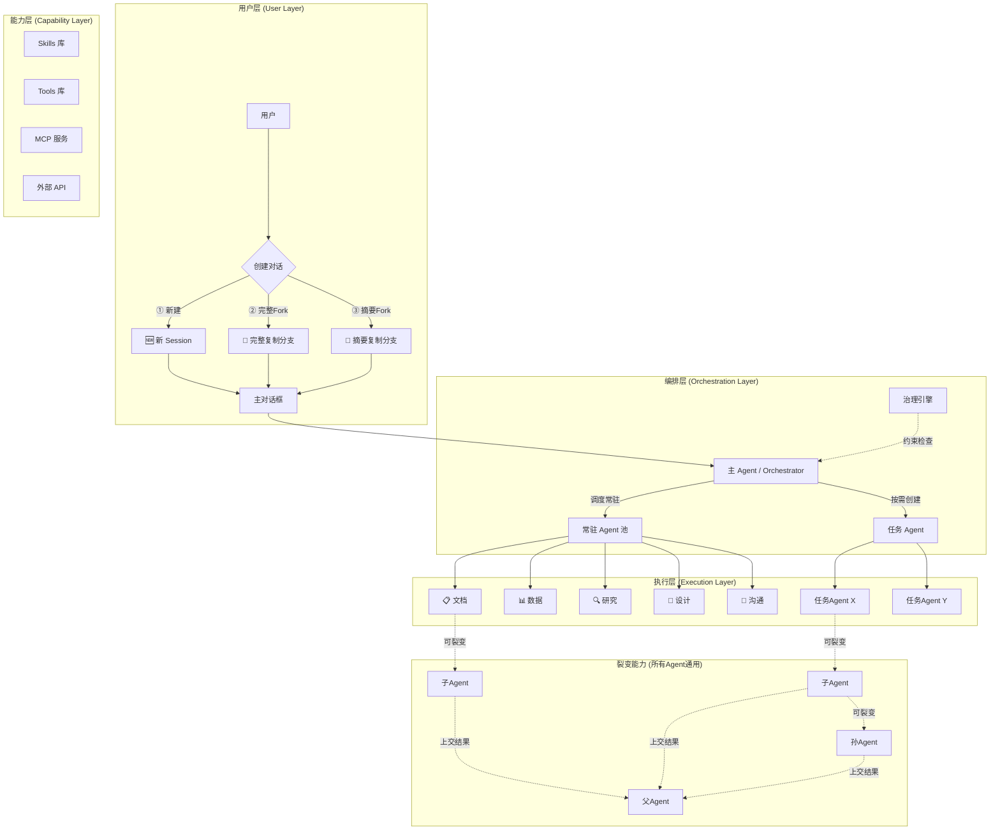
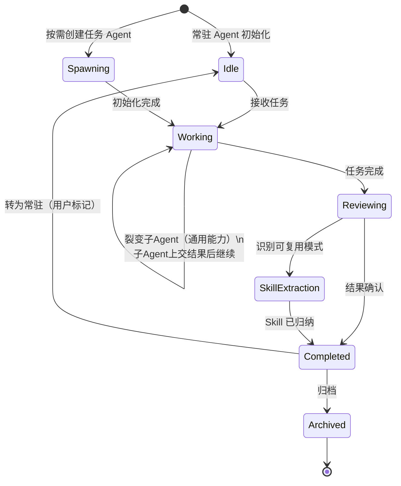
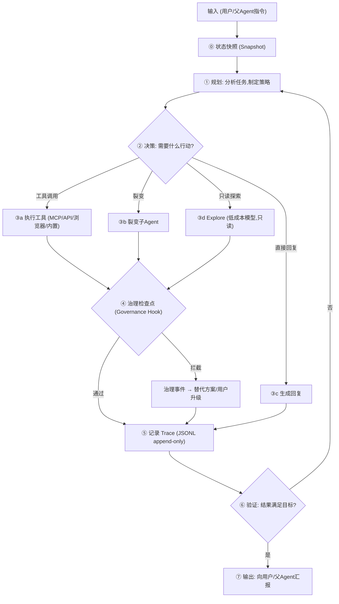
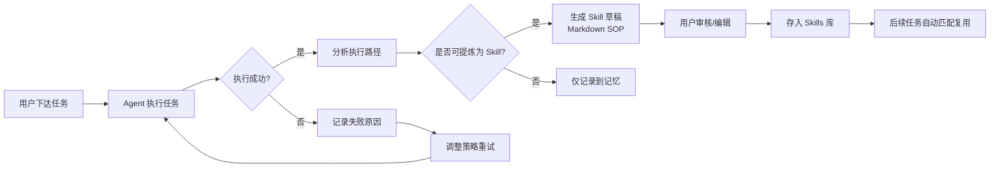
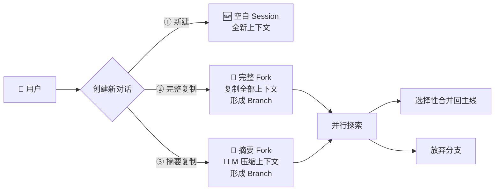
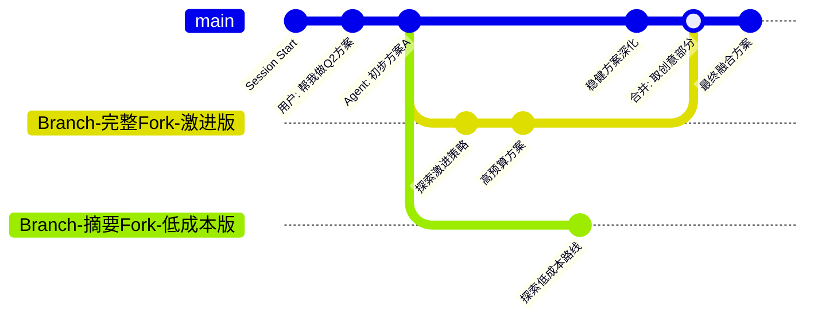
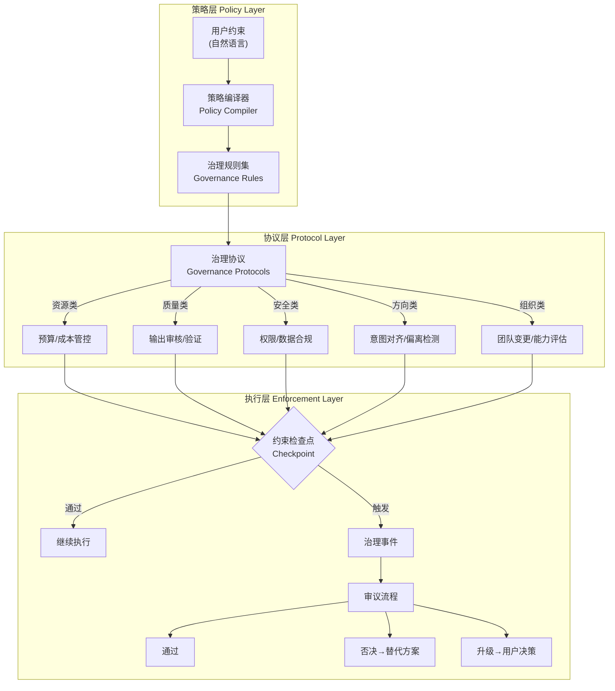
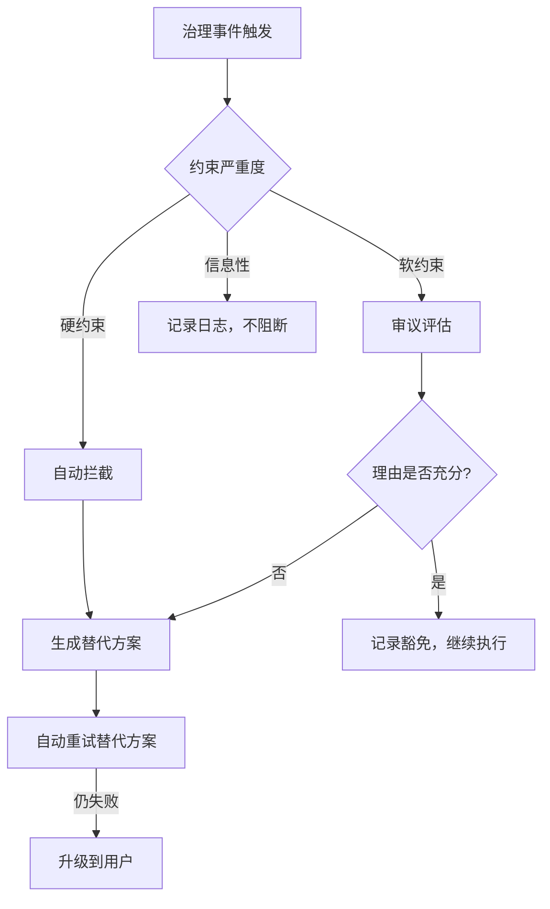
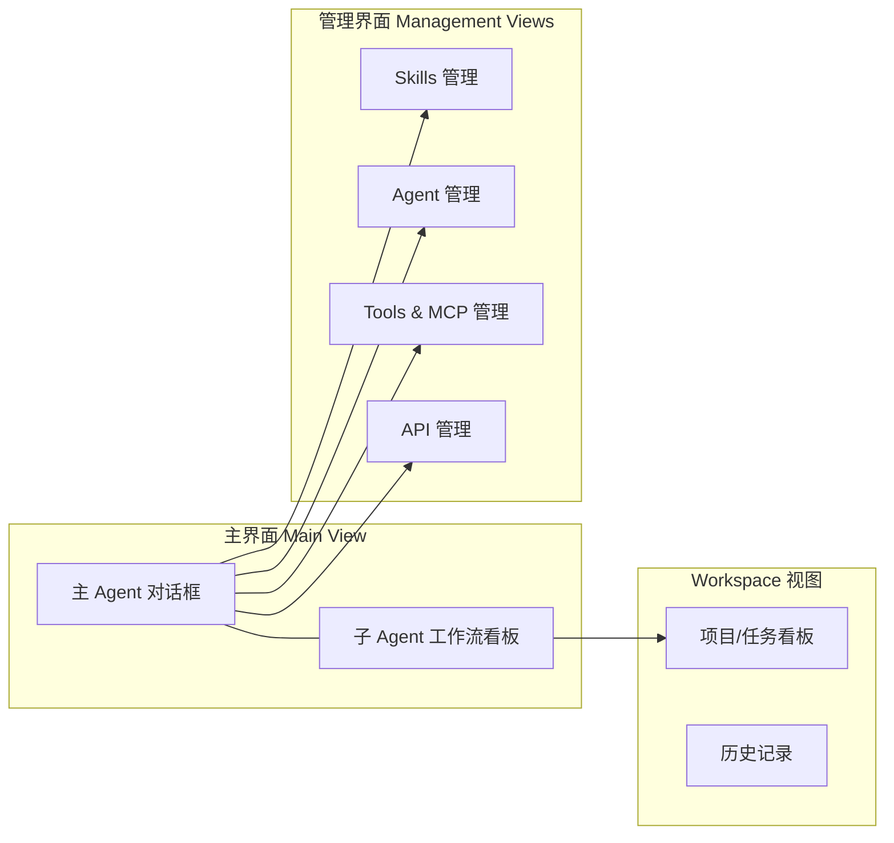

# TAgent — AI 办公协作助手：产品分析与实施方案

## 一、我的总体看法

这个项目方向**非常正确且时机恰当**。原因如下：

1. **市场空白明确**：当前的 agent 产品（Claude Code、Codex CLI、Aider 等）几乎全部面向程序员，非技术用户被完全忽略
2. **可视化是核心差异化**：将 agent 的"黑盒"变成"玻璃盒"，这是建立用户信任的关键
3. **架构参考成熟**：Hermes、OpenClaw、Claude Code 的架构已经被验证，可以站在巨人肩膀上

但也有需要警惕的地方：

> [!WARNING]
> **范围风险**：你描述的功能集非常庞大（多 agent 编排 + 实时可视化 + Skills 管理 + MCP/API 管理 + Workplace 管理）。需要严格分阶段，否则容易陷入"什么都想做，什么都没做好"的困境。

> [!WARNING]
> **交互复杂度 vs 目标用户**：目标是非技术用户，但 agent 编排、skills 自定义、MCP 配置等本身就是复杂概念。需要在"强大"和"简单"之间找到精确的平衡点。

---

## 二、从参考架构中提取的关键模式

### 2.1 从各参考项目中学到什么

| 参考项目 | 核心启发 | 我们要借鉴的 | 我们要改进的 |
|---------|---------|------------|------------|
| **Hermes** | Skills 自学习系统（成功→提炼→复用）、持久记忆、五大支柱架构 | ✅ Skills 自归纳、✅ 持久记忆、✅ 身份/灵魂组件 | 🔄 CLI-first → 我们 Web-first |
| **Hermes-Team** | SSE+WebSocket 双通道实时通信、**多维 Agent 状态模型**、团队导出/脱敏 | ✅ 双通道方案、✅ 多维状态驱动 UI、✅ `request_human_input` 用户升级 | 🔄 我们增加治理引擎层 |
| **OpenClaw** | 三层架构（Channel→Brain→Body）、**Heartbeat 巡检**、Cron 定时任务 | ✅ 分层解耦、✅ Heartbeat 主动调度、✅ Skills Markdown 定义 | 🔄 单 Agent → 我们多 Agent 递归裂变 |
| **Claude Code** | 动态 Prompt 组装、**隔离上下文+摘要返回**、三层记忆、**并行 Explore Agent** | ✅ 子 Agent 隔离上下文、✅ Explore 只读模式用低成本模型、✅ 三层记忆 | 🔄 子 Agent 不能递归 → 我们支持递归裂变 |
| **OpenCode** | Plan/Build 分离、**JSONL append-only 事件日志**、**Snapshot 撤销**、裂变=工具调用 | ✅ 先规划再执行、✅ Trace 用 append-only 存储、✅ 执行前快照可回滚 | 🔄 已归档，架构设计值得参考 |
| **Codex CLI** | **App Server 解耦**（Agent Runtime 独立于 UI）、**三级审批模式**、沙箱安全 | ✅ Runtime-UI 解耦、✅ 审批映射到治理约束严重度、✅ 沙箱执行 | 🔄 终端 → Web 体验 |
| **Pi** | **四层 Monorepo**（AI抽象/Agent Core/场景/UI）、LLM 内建成本追踪、**树形会话历史** | ✅ 分层 Monorepo 结构、✅ 成本数据喂治理引擎、✅ 树形历史=Session Fork | 🔄 我们增加可视化和治理 |
| **Agent-Browser** | Snapshot+Refs 大幅降低 token、**AI 原生浏览器自动化** | ✅ 内置浏览器 Tool（非独立 Agent）、✅ 安全治理配合（URL 白名单） | 🔄 集成到 Agent Loop 能力层 |

### 2.2 从可解释性 AI 领域学到什么

| 项目/方向 | 核心启发 |
|----------|---------|
| **LangGraph** | 将 agent 工作流建模为有状态循环图，可视化每步决策路径 |
| **VectorInstitute/Agentic-Transparency** | "设计时透明"和"过程时透明"的方法论 |
| **Motia** | "可视化后端"概念——实时展示 agent 行为和 job 执行 |
| **迭代看板(Iterative Kanban)** | 将人-agent 反馈循环作为一等公民而非线性步骤 |
| **A2A Protocol** | Agent 间标准化通信协议（Linux Foundation），Agent Card 能力发现 |
| **LangGraph Studio** | 时间旅行调试——设置断点、修改状态、从检查点恢复执行 |

---

## 三、创新架构设计

### 3.1 整体架构



### 3.2 Agent 二态模型 + 裂变通用能力

| 概念 | 说明 | 类比 |
|------|------|------|
| **🟢 常驻态 (Resident)** | 固定通用 Agent 始终待命 | 公司核心部门 |
| **🟡 任务态 (Task-Spawned)** | 根据任务动态创建，完成后可归档或转为常驻 | 项目组 |
| **⚡ 裂变 (Fission)** — 通用能力 | **所有 Agent 都具备的能力**，无论常驻还是任务态。当任务复杂时可自主创建子 Agent，子 Agent 也可继续裂变，形成递归树。结果逐级上交。 | 任何部门/项目组都能拆分小组 |

> [!IMPORTANT]
> 裂变不是第三种 Agent 类型，而是**所有 Agent 的内建能力**。常驻的"文档助手"也可以裂变出子 Agent 来并行处理一份长文档的不同章节。

### 3.3 Agent 生命周期



### 3.4 Agent Loop 内部结构（系统心脏）

每个 Agent 的执行循环遵循统一的 7 步结构。**治理引擎在步骤④作为 Hook 内嵌**，而非外挂。



**来自参考项目的关键增强**：
- **⓪ 状态快照**（← OpenCode）：每次迭代前保存快照，治理拦截时可回滚到上一步
- **③d Explore 模式**（← Claude Code）：用低成本模型（如 Haiku）进行只读探索，不消耗主模型预算
- **JSONL append-only Trace**（← OpenCode）：Trace 数据用追加写入，O(1) 性能，不重写文件

### 3.5 Agent Card（标准化身份描述）

每个 Agent 具有标准化的 Agent Card，支撑治理检查、静态视图渲染、拖拽管理。

采用**声明式定义**（← Claude Code `.claude/agents/` 模式）+ **多维状态模型**（← Hermes-Team）：

```yaml
agent_card:
  id: "agent-doc-001"
  name: "文档助手"
  type: resident           # resident | task_spawned
  description: "文档生成、编辑、格式化"
  soul: "SOUL.md"          # 人设定义文件（← Hermes-Team）
  
  capabilities:
    skills: ["weekly-report-gen", "proofreading"]
    tools: ["markdown-editor", "browser"]  # 浏览器作为内置工具
    mcp_servers: ["notion-connector"]
    
  constraints:              # 治理引擎读取此字段
    max_fission_depth: 3
    max_cost_per_task: "$1"
    allowed_data_sensitivity: "low"
    approval_mode: "suggest" # suggest | auto_edit | full_auto（← Codex CLI 三级审批）
    
  state:                    # 多维状态模型（← Hermes-Team）
    business: idle           # idle | busy | waiting
    runtime: running         # stopped | running | error
    human_interaction: idle  # idle | waiting_human
    orchestration: none      # none | waiting_workers | fissioned
    
  heartbeat:                # 主动巡检（← OpenClaw）
    enabled: true
    interval_minutes: 30
    checklist: "HEARTBEAT.md"
    
  stats:
    tasks_completed: 142
    avg_quality_score: 0.91
  parent: null
```

**多维状态如何驱动 UI**：
| 状态维度 | 驱动的 UI 元素 |
|---------|---------------|
| `business` | 工作流节点动画（脉动/静止/等待旋转） |
| `runtime` | 健康状态指示灯（绿/红/灰） |
| `human_interaction: waiting_human` | 弹出用户决策卡片 |
| `orchestration: fissioned` | 节点展开显示子 Agent 树 |

### 3.6 Observability Trace 数据模型

所有可视化均消费此统一数据模型。采用 **JSONL append-only** 存储（← OpenCode），O(1) 写入性能：

```yaml
trace:
  trace_id: "tr-001"
  agent_id: "agent-doc-001"
  session_id: "sess-abc"
  parent_trace_id: null     # 裂变时指向父trace
  snapshot_id: "snap-001"   # 关联的状态快照（可回滚）
  spans:
    - { type: "snapshot", state_hash: "abc123" }
    - { type: "planning", summary: "策略：先拉Jira数据再生成报告", tokens: 700, cost: "$0.003" }
    - { type: "tool_call", tool: "jira-connector", duration_ms: 3400 }
    - { type: "explore", model: "haiku", query: "搜索竞品数据", cost: "$0.0003" }
    - { type: "browser_action", url: "https://jira.company.com", action: "extract_data", screenshot: "snap-002.webp" }
    - { type: "governance_check", policy: "resource.budget_cap", result: "passed" }
    - { type: "fission", child_agent_id: "agent-doc-001-sub-1", reason: "并行处理不同章节" }
    - { type: "output", confidence: 0.89, quality_check: "passed" }
```

### 3.7 实时通信架构

采用 **SSE + WebSocket 双通道**（← Hermes-Team 验证方案）：

| 通道 | 用途 | 持久化 |
|------|------|--------|
| **SSE** | 结构化事件（任务创建、状态变更、治理事件、完成通知） | ✅ 持久化到数据库 |
| **WebSocket** | 高频流式输出（Agent 运行时的 token 流、实时日志） | ❌ 不持久化 |

Agent 间通信采用标准化消息（参考 A2A 协议），消息类型：

| 消息类型 | 方向 | 用途 |
|---------|------|------|
| `TaskRequest` | 父→子 | 委派任务，含目标、上下文、约束 |
| `TaskProgress` | 子→父 | 进度汇报，含状态和中间结果 |
| `TaskComplete` | 子→父 | 完成汇报，含**摘要结果**（← Claude Code 隔离上下文+摘要返回） |
| `TaskFailed` | 子→父 | 失败汇报，含原因和已尝试方案 |
| `GovernanceEvent` | 治理引擎→Agent | 约束检查结果通知 |
| `HumanInputRequest` | Agent→用户 | 请求用户输入（← Hermes-Team `request_human_input`） |

### 3.8 Skills 自学习系统（借鉴 Hermes）



**Skills 的数据结构**（借鉴 Hermes + Superpowers 格式）：

```yaml
---
name: weekly-report-generation
description: 生成团队周报，汇总本周工作进展和下周计划
category: 文档
trigger: 用户提及"周报"或"weekly report"
confidence: 0.92  # 历史成功率
created_from: task-2025-0531  # 来源任务
---

## 前置条件
- 需要访问项目管理工具（Jira/Notion）
- 需要本周的 commit/PR 记录

## 执行步骤
1. 从项目管理工具拉取本周 completed 任务
2. 从代码仓库拉取本周 PR 合并记录
3. 按模板生成周报草稿
4. 发送给用户审核

## 使用的工具
- MCP: jira-connector
- API: github-api
- Tool: markdown-formatter
```

### 3.9 Session 管理与分支合并系统

#### 三种创建方式



| 方式 | 上下文 | 适用场景 | Token 消耗 |
|------|--------|---------|-----------|
| **① 新建** | 空白（可选继承其他 Session 的摘要） | 全新任务 | 无 |
| **② 完整复制 Fork** | 完整复制当前上下文 | 精细分支探索、需完整推理链 | 高 |
| **③ 摘要复制 Fork** | LLM 提炼关键结论+决策点 | 轻量探索不同方向 | 低 |

摘要复制支持**自定义保留粒度**——用户可标记哪些消息"必须保留"，哪些可被压缩。

#### 分支生命周期：Fork → 探索 → Merge/Abandon



#### 跨 Session 记忆继承

除了 Fork（基于同一 Session 的分支），用户也可跨不同 Session 继承上下文：
- **压缩继承**：从历史 Session 导入 LLM 生成的摘要
- **完整继承**：从历史 Session 导入完整上下文

#### Session 树可视化

```
                    ┌─ ②完整Fork (激进版) ── Merged ──┐
Session Start ──●──●──●                                 ●── 最终方案
                    └─ ③摘要Fork (低成本版) ── Abandoned
```

侧栏展示完整 Session 树形结构，点击任意节点可回溯到当时的上下文状态。Diff 视图支持左右分栏对比不同分支的方案差异。

#### Session Merge 语义定义

| 项 | 定义 |
|----|------|
| **谁发起** | 用户手动触发（非自动合并） |
| **合并什么** | 用户在 Diff 视图中勾选要保留的结论/段落，LLM 辅助融合成连贯文本 |
| **冲突处理** | 相互矛盾的结论高亮标记，用户选择保留哪个或让 LLM 提出折中方案 |
| **合并后** | 生成新的 commit 节点，原分支保留可回溯 |

### 3.10 组织治理引擎（Governance Engine）——架构模式

> [!TIP]
> 这不是一个功能点，而是一个**架构层**。它将组织行为学的制衡、审计、决策流程抽象为可配置的运行时引擎，贯穿所有 Agent 活动。

#### 核心架构：三层治理模型



#### 1. 策略层：从自然语言到治理规则

用户在项目 Plan 阶段用自然语言设定约束，策略编译器自动转化：

```yaml
# 用户说："控制成本，质量优先，涉及客户数据要小心"
# 系统编译为：
governance:
  policies:
    - type: resource
      rule: budget_cap
      params: { max_cost_per_task: "$5", alert_threshold: 0.8 }
      severity: hard  # 硬约束，不可违反
    - type: quality
      rule: output_review
      params: { min_confidence: 0.85, require_cross_check: true }
      severity: soft  # 软约束，可在理由充分时豁免
    - type: security
      rule: data_sensitivity
      params: { pii_detection: true, require_approval_for_external_api: true }
      severity: hard
    - type: alignment
      rule: intent_drift_detection
      params: { max_drift_score: 0.3 }
      severity: soft
```

#### 2. 协议层：五类治理协议

| 协议类型 | 关注点 | 检查时机 | 典型场景 |
|---------|--------|---------|---------|
| **资源治理** | Token、API 调用、时间成本 | 任务分配前、Agent 创建时、裂变时 | 成本超预算、资源浪费 |
| **质量治理** | 输出准确性、一致性、完整性 | 关键输出节点、任务完成时 | 交叉验证、质量回归 |
| **安全治理** | 数据隐私、权限边界、外部调用 | 涉及敏感操作时 | PII 检测、API Key 暴露 |
| **方向治理** | 任务与用户意图的对齐度 | 持续监测 | 任务方向偏离、过度工程 |
| **组织治理** | 团队变更合理性、能力匹配 | Agent 创建/销毁/裂变时 | 新 Agent 是否必要、角色重复 |

#### 3. 执行层：治理事件与审议流程

当约束检查点触发治理事件时，系统启动**审议流程**。审议模式根据场景自动选择：



| 审议模式 | 触发条件 | 参与者 | 决策方式 |
|---------|---------|-------|---------|
| **自动裁决** | 硬约束违反 + 有明确替代方案 | 治理引擎自行处理 | 规则匹配 |
| **Agent 间审议** | 软约束违反 + 需要权衡 | 相关 Agent 提供各自评估 | 主 Agent 综合判断 |
| **用户升级** | 多方案均不满足约束，或涉及用户价值取舍 | 用户 | 用户选择 |

#### 4. 你的成本审计案例在此架构中的位置

你提到的"新增 Agent 需要经过成本审计 Agent 表决"是**组织治理协议 + 资源治理协议**的一个实例：

```
用户约束"控制成本" 
  → 策略编译为 resource.budget_cap + organization.team_change_review
  → 当主 Agent 提议创建新 Agent 时触发组织治理检查点
  → 资源协议评估成本影响
  → 如果超预算（硬约束）→ 自动拦截 → 生成精简版替代方案
  → 如果替代方案仍不满足 → 升级到用户："是否允许增加预算？"
```

但同一套引擎也能处理完全不同的场景：
- **质量治理**：Agent 生成的报告被质量协议拦截（置信度不足）→ 要求交叉验证或补充数据
- **方向治理**：检测到任务执行偏离了用户原始意图 → 暂停并提示"当前方向是否正确？"
- **安全治理**：Agent 试图调用外部 API 传输用户数据 → 硬约束拦截，要求用户授权

#### 5. 治理的可视化呈现

在工作流看板中，治理事件以特殊节点呈现：

| 节点类型 | 视觉 | 含义 |
|---------|------|------|
| 🟢 **检查通过** | 绿色小盾牌（不阻断流程） | 约束检查已通过 |
| 🟡 **软约束豁免** | 黄色标记 + 可展开理由 | 审议后决定继续 |
| 🔴 **硬约束拦截** | 红色节点 + 替代方案分支 | 被拦截，走替代路径 |
| 👤 **用户决策点** | 蓝色暂停标记 | 等待用户输入 |
| 📊 **治理仪表盘** | 侧边统计面板 | 本项目的约束触发次数、成本趋势等 |

用户可以点击任何治理节点，回溯完整的决策链：**谁触发的 → 什么约束 → 评估结果 → 最终决策 → 为什么**。

---

## 四、可视化设计方案

### 4.1 页面架构



### 4.2 主界面布局设计

```
┌─────────────────────────────────────────────────────────────────┐
│  🧠 TAgent                    [Workspace ▼]  [⚙️]  [👤 用户]     │
├───────────────┬─────────────────────────────────────────────────┤
│               │                                                 │
│  📋 常驻Agent │   ┌─── 主 Agent 对话区 ─────────────────────┐   │
│  ┌──────────┐ │   │                                         │   │
│  │📄 文档   │ │   │  🤖 主 Agent: 好的，我来帮你准备周报。  │   │
│  │📊 数据   │ │   │     正在调度数据分析师和文档助手...      │   │
│  │🔍 研究   │ │   │                                         │   │
│  │🎨 设计   │ │   │  ┌── 任务进展卡片 ──────────────────┐   │   │
│  │📧 沟通   │ │   │  │ 📊 数据分析师 → 拉取Jira数据 ✅  │   │   │
│  └──────────┘ │   │  │ 📄 文档助手   → 生成草稿 🔄      │   │   │
│               │   │  │ 使用Skills: weekly-report-gen    │   │   │
│  📁 工作空间  │   │  │ 使用MCP: jira-connector          │   │   │
│  ┌──────────┐ │   │  └──────────────────────────────────┘   │   │
│  │ 项目A    │ │   │                                         │   │
│  │ 项目B    │ │   │  [输入框: 告诉主Agent你需要什么...]     │   │
│  │ 日常任务 │ │   └─────────────────────────────────────────┘   │
│  └──────────┘ │                                                 │
│               │   ┌─── 子Agent实时工作流 ────────────────────┐  │
│  🔧 快捷操作  │   │  [实时视图 🔴] / [静态视图 📋]            │  │
│  ┌──────────┐ │   │                                          │  │
│  │ 新建任务 │ │   │  ┌────┐    ┌────┐    ┌────┐             │  │
│  │ 管理Skills│ │   │  │拉取│───▶│分析│───▶│生成│  ← 动画流转 │  │
│  │ 配置MCP  │ │   │  │数据│    │数据│    │报告│             │  │
│  └──────────┘ │   │  └────┘    └────┘    └────┘             │  │
│               │   └──────────────────────────────────────────┘  │
└───────────────┴─────────────────────────────────────────────────┘
```

### 4.3 工作流看板的两种视图

#### 实时视图 (Real-time View)
- 采用 **React Flow / XYFlow** 渲染有向图
- 节点代表 Agent/步骤，边代表数据流转
- **动画效果**：数据沿边流动（粒子动画）、节点状态变化（脉动/闪烁）
- WebSocket 推送实时状态更新
- 节点可点击展开查看详细日志/推理过程

#### 推理轨迹时间线（Reasoning Timeline）

在对话区域中，用户可展开任何 Agent 输出，看到为**非技术用户设计**的交互式时间线：

```
[14:30:01] 🧠 正在思考: "需要先获取项目数据，再汇总"     ← 可展开
[14:30:02] 🔧 使用工具: Jira连接器                      ← 可展开看结果
[14:30:05] 🛡️ 安全检查: 成本=$0.003, 预算充足 ✅         ← 绿色盾牌
[14:30:06] ⚡ 分配任务: 让"数据助手"处理可视化部分        ← 可跳转
[14:30:08] 📝 生成: 周报草稿                             ← 可展开全文
[14:30:10] ✅ 质量检查: 可信度 89%, 通过 ✅               ← 可展开详情
```

> [!NOTE]
> 前端术语策略：所有技术概念对用户使用自然语言描述。例如："治理检查"→"安全检查"，"裂变"→"分配任务"，"Trace"→"工作记录"。

#### 时间旅行（Time-Travel）

用户可点击时间线任意节点，回溯到当时状态，修改参数后重新执行——自动创建一个 Session Fork。

#### 静态视图 (Static View)
- 展示 Team 组成：哪些 Agent、各自的 Skills 和 Tools
- 类似**组织架构图**的呈现方式
- 每个 Agent 卡片展示：
  - 名称、角色描述
  - 拥有的 Skills 列表
  - 可用的 Tools/MCP
  - 历史执行统计

### 4.4 Skills/Agent/Tools/MCP/API 可视化管理

设计为**模块化的 Bento Grid 布局**，支持：

| 管理对象 | 可视化方式 | 用户操作 |
|---------|----------|---------|
| Skills | 卡片网格，按分类/标签筛选 | 查看、编辑、启用/禁用、拖拽分配给 Agent |
| Agent | 角色卡片，显示能力雷达图 | 创建、编辑角色、配置 Skills/Tools |
| Tools | 工具列表，显示连接状态 | 安装、配置、测试连接 |
| MCP | 服务卡片，显示协议状态 | 添加 MCP Server、配置参数 |
| API | API 端点列表 | 添加、配置 Key、测试调用 |

**拖拽交互**：用户可以将 Skill 卡片拖拽到 Agent 卡片上来分配能力，类似**积木搭建**的体验。

### 4.5 Workspace（工作空间）交互设计

> [!IMPORTANT]  
> 这是面向非技术用户的第一印象页面，必须做到极致。

**登录后首页的设想**：

```
┌─────────────────────────────────────────────────────────────┐
│                                                             │
│     "下午好，小明 ☀️"                                       │
│     "你有 3 个进行中的项目，1 个待审核的报告"                  │
│                                                             │
│  ┌─────────────┐  ┌─────────────┐  ┌─────────────┐         │
│  │ 🏢 Q2营销    │  │ 📊 月度报告  │  │ 📧 客户跟进  │         │
│  │ 方案策划     │  │             │  │             │         │
│  │             │  │ 进度: 75%   │  │ 进度: 40%   │         │
│  │ 进度: 60%   │  │ 2 Agent工作中│  │ 待启动      │         │
│  │ 3 Agent工作中│  │             │  │             │         │
│  │             │  │ [最近: 2h前] │  │ [最近: 昨天] │         │
│  │ [最近: 刚刚] │  │             │  │             │         │
│  └─────────────┘  └─────────────┘  └─────────────┘         │
│                                                             │
│  ┌─ 快速开始 ──────────────────────────────────────────┐    │
│  │ "帮我做什么？" ___________________________________  │    │
│  │                                                     │    │
│  │ 💡 智能建议:                                        │    │
│  │ [📋 继续Q2策划] [📊 催促月报数据] [✍️ 新建任务]       │    │
│  └─────────────────────────────────────────────────────┘    │
│                                                             │
│  ┌─ 近期活动 ──────────────────────────────────────────┐    │
│  │ 🕐 14:30  文档助手完成了"竞品分析报告"草稿           │    │
│  │ 🕐 13:15  数据分析师提取了本周销售数据               │    │
│  │ 🕐 11:00  研究员完成了市场趋势调研                   │    │
│  └─────────────────────────────────────────────────────┘    │
└─────────────────────────────────────────────────────────────┘
```

**设计要点**：
- **Bento Grid** 布局展示不同 Workspace
- 每个 Workspace 卡片显示：活跃 Agent 数、进度、最近活动
- 悬停显示微缩工作流预览（微动画）
- **智能建议**：基于上下文推荐下一步操作
- 整体色调：深色主题 + 渐变强调色 + 毛玻璃效果

---

## 五、技术栈建议

### 5.1 前端

| 层次 | 技术选择 | 理由 |
|-----|---------|------|
| 框架 | **Next.js 15 (App Router)** | SSR/SSG、API Routes、成熟生态 |
| 状态管理 | **Zustand** | 轻量、简单、适合复杂但模块化的状态 |
| 工作流可视化 | **React Flow (XYFlow)** | 业界标准的节点图编辑器，支持自定义节点和动画 |
| 实时通信 | **WebSocket + Server-Sent Events** | Agent 状态实时推送 |
| UI 组件 | **shadcn/ui + Radix UI** | 高质量、可定制、无样式锁定 |
| 动画 | **Framer Motion** | 流畅的微动画和页面过渡 |
| 拖拽 | **dnd-kit** | 现代拖拽库，支持复杂的拖放交互 |
| 图表 | **Recharts / Nivo** | 数据可视化 |
| CSS | **CSS Modules + CSS Variables** | 主题系统和组件隔离 |

### 5.2 后端（分层 Monorepo，参考 Pi Framework）

**项目结构**（← Pi 四层 Monorepo）：
```
packages/
  tagent-ai/        → LLM 抽象层（多 Provider 归一化 + 内建成本追踪）
  tagent-core/      → Agent Runtime（Loop、状态、通信、治理引擎）— 不绑定 UI
  tagent-server/    → App Server（WebSocket/SSE/JSON-RPC API）— 服务所有前端
  tagent-web/       → Next.js Web UI
```

> [!TIP]
> **关键架构原则**（← Codex CLI App Server + Pi 分层）：Agent Runtime 完全独立于 UI。`tagent-core` 可以被 CLI、Web、移动端、甚至第三方项目嵌入使用。

| 层次 | 技术选择 | 理由 |
|-----|---------|------|
| 运行时 | **TypeScript (Bun)** | 全栈统一语言，共享类型定义 |
| LLM 抽象 | **tagent-ai**（← Pi `pi-ai` 模式） | 统一 streaming/tool calling/cost tracking，屏蔽 Provider 差异 |
| Agent 运行时 | **tagent-core**（自研 Agent Loop） | 核心竞争力，**可独立嵌入** |
| App Server | **JSON-RPC 双向接口**（← Codex CLI） | 一套后端服务所有前端 |
| 浏览器工具 | **agent-browser (Playwright)**（← Agent-Browser） | AI 原生浏览器自动化，内置工具非独立 Agent |
| MCP 集成 | **MCP SDK**（支持 http/streamable_http/stdio 三种传输） | 标准协议 + 全传输支持（← Hermes-Team） |
| 数据库 | **PostgreSQL + Redis** | 持久化 + 缓存/会话 |
| Trace 存储 | **JSONL append-only 文件 + PostgreSQL 索引** | 高频写入用文件，查询用数据库（← OpenCode） |
| 消息队列 | **Redis Streams / BullMQ** | Agent 任务调度和事件驱动 |
| 安全隔离 | Phase 1-2: **目录白名单 + 工具权限控制**；Phase 3+: **Docker 容器**（← Codex CLI） | 渐进式安全，MVP 不引入 Docker 依赖 |

### 5.3 AI 层

| 层次 | 技术选择 | 理由 |
|-----|---------|------|
| 模型选择 | **Model-Agnostic**（支持多家 Provider） | 参考 Hermes/OpenClaw 的做法 |
| Prompt 管理 | **动态 Prompt 组装**（参考 Claude Code） | 根据 Agent 角色 + 上下文动态构建 |
| 记忆系统 | **三层记忆**（上下文 / 会话文件 / 全局配置） | 参考 Claude Code 的三层记忆架构 |

---

## 六、分阶段开发路线图

> [!NOTE]
> **排期模式**：单人 vibecoding（AI 辅助开发）。由于有 AI pair programming 加速，不简单翻倍，而是按 1.5x 系数调整。Phase 3a/3b 必须串行。

### Phase 0：项目启动（1 周）✅ 决策已锁定

> **目标**：开发环境就绪，架构共识确认

| 决策项 | 结果 |
|--------|------|
| 产品名称 | **TAgent** |
| 部署方式 | **两者兼顾**：Phase 1 先做自托管（无需复杂认证），Phase 3+ 加 SaaS 层 |
| 首个验证场景 | **"帮我调研支付 agent 的现状"**（调研任务） |
| 首选 LLM | **Claude + GPT**（2 Provider） |
| 团队 | **单人 vibecoding** |

- [ ] Monorepo 初始化（Turborepo + `tagent-ai` / `tagent-core` / `tagent-server` / `tagent-web`）
- [ ] CI 基础搭建（lint + type-check + build 通过）
- [ ] 设计系统 Token 初始化（色彩/字体变量）

**Phase 0 验证**：`pnpm dev` 四个包均可独立运行，lint 全绿。

---

### Phase 1：单 Agent 端到端跑通（8-9 周）

> **目标**：一个 Research Agent 完整执行调研任务，并以精美 UI 展示全过程。
> **Demo Day 交付物**：用户输入"帮我调研支付 agent 的现状" → Agent 搜索网页 → 阅读并总结 → 生成调研报告 → 用户在推理时间线中看到每一步。

#### Week 1-3：后端核心

| 任务 | 包 | 依赖 | 验证标准 |
|------|----|------|---------|
| LLM 抽象层（Claude + GPT，内建成本追踪） | tagent-ai | 无 | 调用 2 个 Provider 返回流式响应 + 打印 token/cost |
| Agent Loop 原型（7步 + Snapshot） | tagent-core | tagent-ai | 单 Agent 接收指令 → 规划 → 执行工具 → 输出，循环至少 3 轮 |
| Agent Card 基础结构（business + runtime 2维） | tagent-core | 无 | Agent Card YAML 可被 runtime 解析和使用 |
| JSONL Trace 写入 | tagent-core | 无 | 每次 Loop 迭代自动追加 span 到 .jsonl 文件 |
| 内置工具：Web 搜索 + URL 内容读取 | tagent-core | 无 | Agent 可调用搜索 API 并读取网页内容 |

> [!TIP]
> **首个场景是调研任务**，所以首批工具是 **Web 搜索 + URL 内容读取**（而非 Jira）。搜索可用 Tavily API / SerpAPI，内容读取用 HTTP fetch + LLM 摘要。

#### Week 4-6：服务层 + 前端骨架

| 任务 | 包 | 依赖 | 验证标准 |
|------|----|------|---------|
| JSON-RPC API + SSE/WebSocket 双通道 | tagent-server | tagent-core | 前端 WebSocket 连接后能收到 Agent 流式输出 |
| 设计系统（色彩/字体/组件/深色主题） | tagent-web | 无 | 设计 Token 文档 + 5 个基础组件可用 |
| 主 Agent 对话框（流式输出） | tagent-web | tagent-server | 用户输入 → 前端流式显示 Agent 回复 |
| 推理时间线基础版 | tagent-web | Trace 数据 | 展开 Agent 回复可看到步骤时间线（硬编码翻译模板） |

#### Week 7-9：场景闭环 + 首页

| 任务 | 包 | 依赖 | 验证标准 |
|------|----|------|---------|
| Explore 模式（低成本模型只读搜索） | tagent-core | tagent-ai | Agent 用便宜模型并行搜索多个信息源 |
| Workspace 管理（创建/切换/删除） | tagent-web | tagent-server | 用户可创建 Workspace 并在其中与 Agent 对话 |
| 登录后首页（Workspace 卡片 + Onboarding） | tagent-web | Workspace API | 首页展示 Workspace 列表，新用户有引导 |
| Session 基础管理（新建/切换/树形历史） | tagent-web + server | 无 | 用户可创建新 Session 并在侧栏切换 |
| 场景端到端联调 | 全部 | 全部 | "调研支付 agent" 从输入到报告完整跑通 |

**Phase 1 验证 Checklist**：
- [ ] 端到端：输入"帮我调研支付 agent 的现状" → 搜索 → 阅读 → 生成报告
- [ ] 首屏加载 < 2s
- [ ] Agent 流式响应首 token < 500ms
- [ ] Trace JSONL 文件可手动检查正确性
- [ ] 成本追踪：每次对话显示 token 消耗和费用
- [ ] 深色主题视觉效果达到设计标准

---

### Phase 2：多 Agent 编排 + 治理基础（10 周）

> **目标**：主 Agent 可编排多个子 Agent 协作完成复杂任务，治理引擎能拦截超预算操作。
> **Demo Day 交付物**：用户说"帮我做竞品分析报告" → 主 Agent 编排研究 Agent + 文档 Agent → 实时工作流看板展示进度 → 治理引擎在成本超限时拦截并提示用户。

#### Week 1-2：多 Agent 基础

| 任务 | 依赖 | 验证标准 |
|------|------|---------|
| Agent 间通信协议（5 种消息类型 + HumanInputRequest） | Agent Loop | 父 Agent 发 TaskRequest → 子 Agent 返回 TaskComplete（含摘要） |
| 常驻 Agent 池（3 个角色先行：文档/数据/研究 + SOUL.md） | Agent Card | 3 个常驻 Agent 可独立执行任务 |
| 任务 Agent 动态创建 + 隔离上下文 + 摘要返回 | 通信协议 | 创建任务 Agent → 完成 → 只返回摘要给主 Agent |
| 主 Agent 编排逻辑（任务分解 + 分派 + 汇总） | 通信协议 | 主 Agent 收到复杂任务时自动分配给子 Agent |

#### Week 3-4：裂变 + 工具 + 看板

| 任务 | 依赖 | 验证标准 |
|------|------|---------|
| Agent 裂变通用能力（深度限制 2 层 + Explore） | 常驻 Agent | Agent A 裂变出 Agent A-1 → 执行 → 结果上交 |
| 浏览器工具集成（无状态抓取 + URL 白名单） | Agent Loop | Agent 调用浏览器抓取网页内容并返回结构化数据 |
| 实时工作流看板（React Flow + 节点动画） | SSE 事件 | 多 Agent 工作时看板实时更新节点状态 |
| Agent Card 扩展为 4 维状态（+ human_interaction + orchestration） | 基础 Agent Card | 看板节点根据 4 维状态显示不同动画/徽章 |

#### Week 5-7：治理引擎 + 审批

| 任务 | 依赖 | 验证标准 |
|------|------|---------|
| 治理引擎框架（Hook 进 Agent Loop 步骤④） | Agent Loop | Agent 执行工具前触发治理检查 |
| 资源协议（成本硬上限 + 迭代次数限制） | 治理框架 + 成本追踪 | 当累计成本超过阈值时，Agent 被自动拦截 |
| 安全协议（工具权限白名单 + 目录访问限制） | 治理框架 | Agent 尝试调用未授权工具时被阻断 |
| 预设治理模板（"严格成本" / "质量优先" / "标准"） | 资源 + 安全协议 | 用户可在项目设置中选择治理模板 |
| 三级审批模式（Suggest / Auto-Edit / Full-Auto） | 治理框架 | Agent Card 的 approval_mode 能控制审批行为 |
| 治理事件可视化（看板中的盾牌/拦截节点） | 看板 + 治理 | 拦截事件在看板中以红色节点呈现 |

**Phase 2 验证 Checklist**：
- [ ] 端到端：复杂任务自动分解为 2-3 个子 Agent 协作完成
- [ ] 看板实时展示多 Agent 工作流程和状态
- [ ] 治理拦截：成本超限时 Agent 被暂停，用户收到提示
- [ ] 裂变深度限制：子 Agent 裂变到 2 层后被阻断
- [ ] 浏览器：Agent 能抓取公开网页并提取信息
- [ ] 100 节点以内看板渲染流畅（60fps）

---

### Phase 3a：Skills 系统 + 工具管理（4 周）

> **目标**：Skills 可创建、编辑、分配给 Agent，MCP 工具可添加和管理。
> **Demo Day 交付物**：用户在管理页面拖拽 Skill 到 Agent 卡片上 → Agent 立即获得新能力 → 下次任务中自动使用。

- [ ] Skills 管理页面（卡片网格 + 分类筛选）
- [ ] Skill 创建：Agent 建议草稿 + 用户编辑确认（不做全自动提炼）
- [ ] 拖拽交互（Skill → Agent 分配，dnd-kit）
- [ ] Agent 管理页面（角色卡片 + 能力雷达图）
- [ ] MCP Server 管理（添加/配置/测试连接，支持 3 种传输）
- [ ] 工作流看板：实时/静态视图切换

**Phase 3a 验证 Checklist**：
- [ ] 创建 Skill → 分配给 Agent → Agent 在任务中使用该 Skill
- [ ] MCP Server 添加后 Agent 可调用其工具
- [ ] 拖拽交互流畅无卡顿

---

### Phase 3b：Session 分支系统（4 周）

> **目标**：用户可以 Fork 对话探索不同方向，并引用分支结论回主线。
> **Demo Day 交付物**：用户在对话中点"探索不同方案" → Fork 出分支 → 在分支中探索 → 将分支结论引用回主对话。

- [ ] Session 完整 Fork（复制当前上下文）
- [ ] Session 摘要 Fork（LLM 压缩上下文）
- [ ] Session 结论摘取引用 + Diff 对比视图（不做自动 Merge）
- [ ] 跨 Session 记忆继承（压缩/完整两种模式）
- [ ] Session 树可视化（侧栏树形结构 + 点击回溯）

**Phase 3b 验证 Checklist**：
- [ ] 完整 Fork：新分支保留全部上下文，可独立对话
- [ ] 摘要 Fork：新分支上下文被压缩但关键信息保留
- [ ] Diff 视图：左右分栏展示两个分支的差异
- [ ] 引用：从分支中选取结论，自动引用到主线 Session

---

### Phase 4：治理深化 + 产品打磨（6 周）

> **目标**：治理引擎完整化，全链路决策可回溯，产品达到公开发布质量。
> **Demo Day 交付物**：完整的治理仪表盘 + 决策链回溯 + 定时任务 + 全面动画优化。

#### Week 1-3：治理深化
- [ ] 质量协议（输出置信度检查 + 交叉验证触发）
- [ ] 治理仪表盘（成本趋势图 + 拦截统计 + 协议触发热力图）
- [ ] 决策链完整回溯（点击任何节点 → 谁触发 → 什么约束 → 结果）
- [ ] 硬/软/信息性三级审议流程

#### Week 4-6：产品打磨
- [ ] 动画和微交互全面优化（Framer Motion）
- [ ] Heartbeat 主动巡检（常驻 Agent 周期性检查 + 按需通知）
- [ ] 定时任务（Cron 表达式 + 持久化调度）
- [ ] 团队导出/导入 + 敏感信息脱敏
- [ ] Docker 沙箱执行环境（渐进式安全升级）
- [ ] 响应式适配（平板 + 移动端基础视图）
- [ ] 性能优化（看板虚拟化、Trace 懒加载、SSE 连接管理）

**Phase 4 验证 Checklist**：
- [ ] 治理仪表盘数据准确且实时更新
- [ ] 决策链回溯可从任意节点追溯到原始约束
- [ ] Lighthouse Performance Score ≥ 90
- [ ] 200+ 节点看板仍流畅
- [ ] 移动端基础浏览可用

---

### 总时间线

```
Phase 0    Phase 1            Phase 2               Phase 3a       Phase 3b       Phase 4
[1 wk]     [8-9 wk]           [10 wk]               [6 wk]         [6 wk]         [8 wk]
|——————|————————————————|——————————————————————|——————————————|——————————————|——————————————————|
启动    单Agent+调研场景   多Agent+治理MVP        Skills/工具    Session分支    治理深化+打磨
                                                 ↑ 串行（单人）↑
```

**总计**：约 40 周（~10 个月），单人 vibecoding 模式。AI 辅助编码可加速实际开发，但调试和联调仍需人工时间。

---

## 七、相比现有产品的核心差异化

| 维度 | 现有产品 (Claude Code / Codex / Hermes) | TAgent |
|-----|---------------------------------------|--------|
| 目标用户 | 程序员 / 技术人员 | **所有人**，尤其是非技术用户 |
| 界面 | CLI 终端 / 简单 Web | **精美 Web UI + 可视化** |
| Agent 可见性 | 日志/文本输出 | **实时工作流图 + 推理时间线 + 粒子动画** |
| Agent 管理 | 配置文件 / 代码 | **拖拽式可视化管理 + Agent Card** |
| Agent 运行时 | 绑定特定 UI | **Runtime-UI 解耦**（Monorepo 可嵌入） |
| 裂变能力 | 单层或无 | **递归裂变 + Explore 只读模式** |
| Skills | 技术人员手写 | **Agent 建议 + 用户确认 + 可视化编辑** |
| 可解释性 | 开发者日志 | **面向非技术用户的推理时间线 + 治理决策链** |
| 会话管理 | 线性对话 | **Fork + 摘取引用 + 树形历史** |
| 治理 | 无或基本限制 | **治理引擎：预设模板→协议→检查点→审议** |
| 实时通信 | 单通道 | **SSE + WebSocket 双通道**（经 Hermes-Team 验证） |
| 成本控制 | 手动监控 | **LLM 层内建成本追踪 → 自动治理拦截** |
| 安全 | 基本沙箱 | **渐进式安全（目录白名单→Docker）+ 三级审批** |

---

## 八、已确认事项

| # | 问题 | 决策 | 日期 |
|---|------|------|------|
| Q1 | 产品命名 | **TAgent** | 2026-06-01 |
| Q2 | 部署方式 | **两者兼顾**：Phase 1 自托管，Phase 3+ 加 SaaS | 2026-06-01 |
| Q3 | 首个验证场景 | **"帮我调研支付 agent 的现状"** | 2026-06-01 |
| Q4 | 团队规模 | **单人 vibecoding**（AI 辅助开发） | 2026-06-01 |

---

## 九、Verification Plan

### 每个 Phase 的通用验证

| 维度 | 标准 |
|------|------|
| **功能完整性** | Phase 的 Demo Day 交付物可完整演示 |
| **性能** | 首屏 < 2s，首 token < 500ms，看板 60fps |
| **代码质量** | TypeScript 严格模式，0 type error，lint 全绿 |
| **测试** | 核心模块（Agent Loop / 治理引擎 / 通信协议）有单元测试 |
| **设计** | 深色主题视觉达标，动画流畅，非技术用户可理解界面 |

### 关键风险及缓解

| 风险 | 可能性 | 影响 | 缓解措施 |
|------|--------|------|---------|
| Agent Loop 自研复杂度超预期 | 中 | Phase 1 延期 | Phase 1 Week 2 末评审：如 Loop 未跑通，考虑先用 LangGraph 快速验证 |
| 多 Agent 通信调试困难 | 中 | Phase 2 延期 | 先实现 2 Agent 通信，验证后再扩展到 5 Agent |
| 实时看板性能问题 | 低 | Phase 2 体验 | 先 mock 数据验证 React Flow 性能上限，再接真实数据 |
| Session Fork 上下文过大 | 中 | Phase 3b 成本 | 设置上下文大小上限（如 100K tokens），超限提示用户摘要 Fork |
| 治理引擎过度拦截影响体验 | 中 | Phase 2 体验 | 默认使用"标准"模板（宽松），用户可手动切到"严格" |

